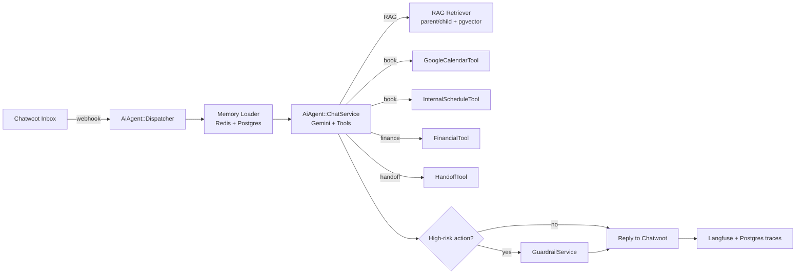
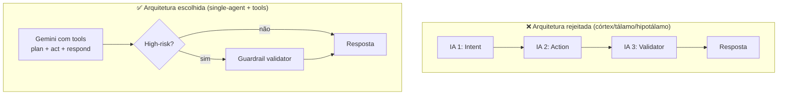

# Plano de Ação — AI Agent Plugin (Atendimento Humanizado e Agêntico)

## 📌 Visão Geral

Este documento define o plano de ação para construir um **agente de IA humanizado, inteligente e agêntico** para a Klivy, capaz de atender clientes de clínicas odontológicas, estéticas e de bem-estar. O agente deve ser plugado a uma caixa de entrada (inbox), responder mensagens com naturalidade humana, consultar uma base de conhecimento (RAG), executar ações em sistemas externos (Google Agenda, agenda interna, financeiro) e transferir para humanos quando necessário.

O plano respeita rigorosamente a **arquitetura limpa em plugins** já estabelecida pela Klivy (vide [`plugins/billing/`](../../plugins/billing/) como referência canônica) e reutiliza ao máximo o subsistema **Captain** já existente no enterprise core.

---

## 📊 Status Geral (atualizado 2026-05-06)

> **⚠️ Importante:** este documento é o plano **histórico** das Fases 0–7 (MVP inicial da Bea). A partir de 2026-05-06, **todo o roadmap ativo** (Sprints A–I + extensões F2/G2/H2) ficou consolidado em [`ai-agent-configuration-plan.md`](ai-agent-configuration-plan.md). Quando precisar do estado atual de uma sprint, do que falta e do que está em produção, leia o configuration-plan; este documento mantém apenas o registro das fases originais para auditoria.
>
> **Sprints ativas em produção (entregues entre 2026-05-05 e 2026-05-06):** A (datetime), B1/B1.5/B2/B3 (slots + multi-doutor + reschedule + cancel + pending_confirmation + Critique), C (emergency SAMU/CVV), D (memória semantic), E (LGPD + CFM 2.454), F MVP (áudio Whisper), F2 (imagem Vision), G MVP (recall proativo), I (Sentinel telemetria), M (memória 24h cross-conversation), S (state machine de confirmações + active service intent).
>
> **Pendentes opcionais:** G2 (lembretes pré-consulta two-way + WhatsApp templates), H (A/B + regen do Sentinel + LLM-as-judge async em sample).

### ✅ Fases concluídas (MVP original — Fases 0–7)

| Fase | Entrega principal |
|---|---|
| **0** — Gemini provider | Gemini configurável via super admin; OpenAI vira fallback. |
| **1** — Scaffold do plugin `ai_agent` | Engine isolada, 6 models de config, ConfigResolver com hierarquia 3 camadas + clamp. |
| **1.5a** — UI super admin global "Bea" (MVP) | Item na sidebar; aba Provider funcional; campos de modelo livres. |
| **1.5b** — UI super admin per-account | Página `/super_admin/accounts/:id/bea` com status, budget, persona, tools, audit log. |
| **2** — RAG parent/child | Upload PDF + chunking hierárquico + retriever pgvector com IVFFlat. |
| **3** — Single-agent + tools + webhook + upload + typing | ChatService completo, listener Chatwoot, AgentBot "Bea", indicador "digitando…". |
| **4** — Tools de ação (read-only) | 6 tools no total: search_knowledge, transfer_to_human, patient_lookup, list_appointments, financial_status, notify_staff. |
| **5** — Humanização e guardrails | Sentiment, EscalationRules, Validator (diagnóstico/prescrição/garantia), 3 personas builtin. |
| **6** — Observabilidade e feedback | Trace por turno, Pricing por modelo, Feedback 👍/👎, dashboard com 8 KPIs. |
| **7** — Hardening | Rate limit (Redis), fallback automático Gemini→OpenAI, cache de embeddings (30d), runbook completo. |

### ✅ Sprints adicionais entregues (Fase 8 — capacidades agênticas, 2026-05-05/06)

> Detalhes completos por sprint em [`ai-agent-configuration-plan.md` §10](ai-agent-configuration-plan.md). Resumo abaixo.

| Sprint | Entrega principal | Arquivos | Core changes |
|---|---|---|---|
| **A** | Per-turn datetime context (PT-BR), holidays, clinic open/closed status | `context_builder.rb`, `holiday_calendar.rb`, edits em `chat_service.rb` | 0 |
| **B1** | Tool `search_available_slots` com duração por serviço + listas de profissionais | `search_available_slots_tool.rb` | 0 |
| **B1.5** | Multi-doutor por especialidade — Service↔User HABTM + chip UI | `agenda_service_user.rb` (model), edit em `engine.rb`, migration, edits em `EditAgent.vue` (core), `_agent.json.jbuilder` (core) | **2** (Vue + jbuilder) |
| **B2** | Tools `reschedule_appointment` e `cancel_appointment` com guardrails de segurança | `reschedule_appointment_tool.rb`, `cancel_appointment_tool.rb` | 0 |
| **B3** | `pending_confirmation` em AgendaEvent + Critique determinístico antes de book/reschedule | `agenda_event.rb`, `critique.rb`, `book/reschedule_appointment_tool.rb`, `chat_service.rb`, `agenda-constants.js` | 0 |
| **C** | Emergency layer determinístico — SAMU 192 (clínica) / CVV 188 (suicida) antes do LLM | `emergency/detector.rb`, `emergency/responder.rb`, edit em `chat_service.rb` | 0 |
| **D** | Memória semantic consolidada via Distiller noturno + TTL 12m | `memory/distiller.rb`, `consolidate_patient_memory_job.rb`, migration `last_consolidated_at`, cron via engine | 0 |
| **E** | LGPD (`erasure_request` tool) + médico responsável (CFM 2.454/2026) | migration, `erasure_request_tool.rb`, edit em `account_setting.rb`, `prompt_builder.rb`, `tool_registry.rb`, `bea.html.erb` (core), `accounts_controller.rb` (core) | **2** (view + controller) |
| **F MVP** | Voice notes do WhatsApp transcritos via Whisper PT-BR | `multimodal/audio_transcriber.rb`, edit em `chat_response_job.rb` | 0 |
| **F2** | Imagem (receita / foto clínica / exame / documento / outro) + vídeo classificados via OpenAI Vision; sempre escala humano | `multimodal/image_handler.rb`, edits em `chat_response_job.rb` e `message_listener.rb` | 0 |
| **G MVP** | Recall proativo — pacientes dormentes ≥6m sem retorno + opt-out automático ("NÃO" pós-recall) | `proactive/recall_finder.rb`, `proactive_outreach_job.rb`, edits em `engine.rb` (cron) e `chat_service.rb` (opt-out) | 0 |
| **I** | Sentinel pós-LLM em high-stakes (modo telemetria, toggle `CAPTAIN_BEA_SENTINEL_ENABLED`) | `humanization/high_stakes_detector.rb`, `humanization/sentinel.rb`, edit em `chat_service.rb` | 0 |
| **M** | Memória cross-conversation 24h por contato | `memory/cross_conversation_history.rb`, edit em `chat_response_job.rb` | 0 |
| **S** | State machine determinística pra confirmações curtas + active service intent | `state_machine/conversation_context.rb`, edits em `chat_service.rb` | 0 |

### 📦 Inventário do que foi entregue

**Plugin `plugins/ai_agent/`** (5 mudanças no core do Chatwoot, todas registradas em [`PRD.md` §8](PRD.md)):
- 19+ migrations (incluindo `agenda_service_users`, `responsible_physician`, `last_consolidated_at`, seed `erasure_request`)
- 13 models (+ `AgendaServiceUser` no plugin agenda)
- 40+ services (config, RAG, LLM, **state_machine**, **emergency**, **memory/distiller**, **multimodal**, **proactive**, **humanization/critique**, **humanization/sentinel**, **humanization/high_stakes_detector**, tools, guardrail, telemetry, hardening)
- 12 tools (search_knowledge, transfer_to_human, patient_lookup, list_appointments, financial_status, notify_staff, clinic_info, **search_available_slots**, **book_appointment**, **reschedule_appointment**, **cancel_appointment**, **erasure_request**)
- 4 jobs (ChatResponseJob, **ProactiveOutreachJob** cron 14h SP, **ConsolidatePatientMemoryJob** cron 4h SP, audit log)
- Engine com hooks via `to_prepare` + cron registration via `Sidekiq::Cron::Job` (sem tocar `config/schedule.yml`)

**Super Admin UI** (em `app/`):
- Sidebar item "Bea" → `/super_admin/bea` (provider + dashboard 8 KPIs)
- Botão "Configurar Bea" na página da conta → `/super_admin/accounts/:id/bea`
- Sub-página "Documentos" pra upload de PDFs por conta
- Audit log automático em mudanças globais e per-account

**Documentação**:
- Este plano (`docs/01-product/ai-agent-action-plan.md`)
- Runbook operacional (`docs/03-engineering/bea-runbook.md`)

### 🟡 Pendências (não bloqueiam produção)

| # | Item | Por que não foi feito agora |
|---|---|---|
| P1 | **Booking com guardrails (Fase 4.5)** | Read-only cobre 80% dos casos; escrita exige `pending_confirmation` + dupla checagem para evitar agendamento errado. |
| P2 | **Google Calendar OAuth** | Trabalho considerável (Cloud Console + tokens criptografados). `AgendaEvent` interno cobre o caso. Volta se piloto pedir. |
| P3 | **Endpoint público de feedback** (👍/👎 no widget) | Depende de UI do widget; backend pronto. |
| P4 | **Health endpoint + alertas** (Slack/email) | Útil pra monitor externo; runbook + dashboard cobrem o operacional manual. |
| P5 | **A/B testing entre personas** | Estrutura preparada (Trace registra modelo/persona); falta dashboard comparativo. |
| P6 | **Honra de `tone_settings`** no PromptBuilder | Hoje só `system_prompt` da persona é injetado. |
| P7 | **`consecutive_tool_failures` em runtime** | Coluna criada e EscalationRules considera; falta incremento/zeramento real no ChatService. |
| P8 | **Renomear `plugins/agenda` → `schedule` e `plugins/ajuda` → `help`** | Débito técnico de nomenclatura PT-BR; trabalho mecânico de busca/substituição. |
| P9 | **Models não usados ainda**: `Agent`, `ConversationStateSummary` | Esqueleto previsto no plano original; não precisaram aparecer pra MVP. |
| P10 | **Integração Langfuse externa** | Captain já tem instrumentation; reuso direto é trivial mas Trace local cobre observabilidade básica. |
| P11 | **UI da própria conta (rebrand Captain → Bea)** | Captain UI existe e funciona; rebrand visual fica como polish. |

### 🚀 Pra colocar em produção

Checklist mínimo antes de ligar em conta real:

1. ✅ Configurar `CAPTAIN_GEMINI_API_KEY` em `/super_admin/bea`
2. (recomendado) Configurar `CAPTAIN_OPEN_AI_API_KEY` pra fallback
3. Subir 1-3 PDFs em `/super_admin/accounts/:id/ai_agent_documents`
4. Selecionar persona (`Bea — Odontologia` / `Estética` / `Bem-estar`)
5. Marcar **Bea ativa nesta conta**
6. (recomendado) Definir `monthly_token_budget` enquanto valida custo real
7. Testar 5 conversas reais
8. Acompanhar `/super_admin/bea` por 7 dias monitorando: deflection, custo, escaladas

Em caso de problema, consultar [`docs/03-engineering/bea-runbook.md`](../03-engineering/bea-runbook.md).

---

## 🎯 Objetivos

1. Atendimento autônomo de **55–70%** das conversas (benchmark de mercado em produção; vendors prometem 90%+ em demos, mas a realidade fica nessa faixa).
2. Resposta em até **3 segundos** no caminho feliz (1 chamada de LLM com tools, sem pipeline serial de múltiplas IAs).
3. Handoff para humano com **contexto completo** (transcrição, intenção detectada, sentimento) sempre que: cliente pedir, sentimento ficar negativo, ou agente não conseguir resolver em 2 turnos.
4. **Zero alteração no core** do Chatwoot. Tudo isolado em `plugins/ai_agent/`.
5. **Provider único: Gemini**. OpenAI permanece apenas como fallback automático em caso de outage do Gemini (já implementado no Captain). Sem suporte a Anthropic — adicionar provider depois é trivial; suportar 3 desde já é dívida cara sem ROI.
6. **Configuração em 3 camadas** com herança e limites: super admin define padrões e tetos globais; super admin override por conta; usuário operacional via UI Bea (Captain reutilizado).

---

## 🧭 Princípios de Arquitetura (NÃO NEGOCIÁVEIS)

### 1. Clean Architecture em Plugin Isolado

Toda implementação vive em `plugins/ai_agent/`, seguindo o padrão **Rails Engine** com `isolate_namespace`, espelhando a estrutura do plugin `billing/`:

```
plugins/ai_agent/
├── app/
│   ├── controllers/ai_agent/      # API REST namespeada
│   ├── jobs/ai_agent/             # background processing (Sidekiq)
│   ├── models/ai_agent/           # ActiveRecord namespeado
│   └── services/ai_agent/         # regras de negócio puras
├── config/
│   └── routes.rb                  # rotas isoladas via Engine
├── lib/
│   ├── ai_agent/
│   │   ├── engine.rb              # Rails::Engine + extensões via to_prepare
│   │   └── access_control.rb      # se necessário
│   └── ai_agent.rb
├── spec/                          # testes do plugin
└── swagger/                       # documentação OpenAPI
```

Extensões ao core (ex.: `Account.has_many :ai_agents`) **só** dentro de `engine.rb`, no bloco `config.to_prepare`, via `class_eval`. Nunca editar arquivos de core diretamente.

### 2. Nomenclatura 100% em Inglês

- **Pastas, models, classes, métodos, variáveis, rotas**: sempre em inglês.
- Strings de UI traduzíveis ficam em arquivos de i18n (PT-BR, EN, ES) — nunca hardcoded.

> ⚠️ **Débito técnico identificado**: os plugins atuais [`plugins/agenda/`](../../plugins/agenda/) e [`plugins/ajuda/`](../../plugins/ajuda/) violam essa regra. Devem ser renomeados para `plugins/schedule/` e `plugins/help/` em uma migration dedicada (fora do escopo deste plano, mas recomendado antes que a base cresça mais).

#### Brand vs. Código: "Bea" ≠ `ai_agent`

A Klivy decidiu nomear o agente como **Bea** (já visível no menu lateral atual como "BEA"). Mantemos separação rígida:

| Plano | Identificador | Onde aparece |
|---|---|---|
| **Brand / produto** | `Bea` | UI traduzida, marketing, e-mails, página do super admin ("Bea Settings"), menu lateral da conta |
| **Plugin / código** | `ai_agent` | Pasta, namespace Ruby, tabelas (`ai_agent_*`), rotas (`/api/v1/ai_agent/...`), variáveis de ambiente |

Razões:
- Se um dia a marca mudar (Bea → Lia → Kira), o código fica intacto.
- Padrão de mercado (Apple/Siri = `com.apple.intelligence`; Google/Bard = `assistant`).
- Evita conflito visual em logs e telemetria multi-tenant.

Strings "Bea" vivem em `config/locales/*.yml`, nunca hardcoded em código Ruby/JS.

### 3. Separação de Camadas

| Camada | Responsabilidade | NÃO faz |
|---|---|---|
| `controllers/` | HTTP, autenticação, params, serialização | Lógica de negócio |
| `services/` | Regras de negócio, orquestração de tools, chamadas LLM | Acesso direto a HTTP/params |
| `models/` | Persistência, validações, relações | Chamadas externas, regras complexas |
| `jobs/` | Processamento assíncrono (embeddings, ingestão) | Lógica que poderia rodar inline |

### 4. Reutilização do Captain Existente

A Klivy herdou do Chatwoot Enterprise o módulo **Captain**, que já fornece **80% da infraestrutura RAG**:

- [`enterprise/app/models/captain/document.rb`](../../enterprise/app/models/captain/document.rb) — upload de PDF, validação, chunking básico
- [`enterprise/app/models/captain/assistant_response.rb`](../../enterprise/app/models/captain/assistant_response.rb) — pgvector 1536-dim com índice IVF-FLAT
- [`enterprise/app/services/captain/llm/embedding_service.rb`](../../enterprise/app/services/captain/llm/embedding_service.rb) — geração de embeddings
- [`enterprise/app/jobs/captain/documents/response_builder_job.rb`](../../enterprise/app/jobs/captain/documents/response_builder_job.rb) — pipeline de ingestão
- [`enterprise/app/services/captain/tool_registry_service.rb`](../../enterprise/app/services/captain/tool_registry_service.rb) — registro dinâmico de tools
- [`enterprise/app/helpers/captain/chat_helper.rb`](../../enterprise/app/helpers/captain/chat_helper.rb) — loop de tool-calling

O plugin `ai_agent` **estende e customiza** o Captain, **não o substitui**. Adiciona: parent/child chunking, tools clínicas (agenda, financeiro, handoff), provider Gemini, validador seletivo, telemetria de humanização.

---

## 🧠 Pesquisa: O Que Torna um Agente Humanizado e Inteligente

Síntese das melhores práticas de mercado em 2026 (fontes ao final).

### Pilar 1 — Conversational Design Humanizado

- **Tom natural e contextual**: nada de "Olá, como posso ajudá-lo hoje?" engessado. Saudação varia por horário, histórico do paciente, e canal.
- **Reconhecimento de interrupção**: usuário pode mudar de assunto no meio. Agente preserva contexto anterior em memória curta.
- **Empatia explícita**: detectar frustração via análise de sentimento e responder com reconhecimento ("entendo que isso é frustrante…") **antes** de oferecer solução.
- **Microcopy clínico**: linguagem adequada ao setor (paciente, não cliente; consulta, não reunião; profissional, não atendente quando se referir ao dentista/esteticista).
- **Latência percebida**: indicador de digitação (`typing…`) durante o processamento. Se passar de 3s, enviar mensagem de "estou consultando aqui…".

### Pilar 2 — Inteligência Agêntica (Tool Use)

Em 2026, o padrão dominante é **Agentic RAG**: um único agente LLM com acesso a múltiplas tools, capaz de planejar, recuperar contexto e executar ações em loop, em vez de pipelines fixos sequenciais.

**Por que descartar a arquitetura "córtex/tálamo/hipotálamo" (3 IAs em série)**:

- **Latência**: 3 chamadas sequenciais ≈ 3× tempo. Inviável para chat.
- **Custo**: 3× tokens.
- **Erro composto**: cada camada introduz ruído.
- **Modelos modernos não precisam**: Gemini 2.5 Flash/Pro resolve intenção + ação + resposta em um único loop com tools, com qualidade superior.

**Quando vale ter uma camada extra**: apenas como **guardrail/validador seletivo** em ações de alto risco (confirmar agendamento, processar pagamento). Não em todo turno.

### Pilar 3 — RAG com Recuperação Hierárquica (Parent/Child)

Padrão que substitui chunking de tamanho fixo:

- **Child chunks** (100–500 tokens): granulares, com embeddings; usados para **busca por similaridade**.
- **Parent chunks** (500–2000 tokens): blocos maiores que contêm os filhos; usados para **gerar a resposta** (mais contexto, menos fragmentação).
- Resultado: precisão de match (filho) + contexto de geração (pai). Ganho típico de 15–25% em fidelidade da resposta vs. chunking flat.

### Pilar 4 — Memória em Camadas

| Tipo | Onde | TTL | Conteúdo |
|---|---|---|---|
| **Working memory** | LLM context window | turno atual | últimas N mensagens da conversa |
| **Short-term** | Redis | sessão (24h) | resumo da conversa, intenção ativa, tool-calls pendentes |
| **Long-term** | Postgres | permanente | preferências do paciente, histórico de consultas, alergias declaradas |

### Pilar 5 — Observabilidade e Confiança

- **Tracing por turno** (Langfuse já está integrado no Captain): cada chamada LLM, cada tool-call, com latência e tokens.
- **Sentimento por turno**: salvar score de -1 a +1 para análise pós-hoc.
- **Razão da resposta**: armazenar quais documentos do RAG foram citados → auditoria e melhoria contínua.
- **Feedback loop**: thumbs up/down do paciente alimenta dataset de fine-tuning futuro.

### Pilar 6 — Hand-off para Humano (Hybrid Model)

Toda automação séria de 2026 reconhece: IA cobre 55–70%, humano cobre o resto. Critérios automáticos de escalada:

1. Sentimento negativo persistente (2+ turnos com score < -0.3).
2. Cliente pediu explicitamente ("quero falar com alguém").
3. Tool falhou 2× ou intenção não classificada.
4. Tópico sensível: reclamação formal, queixa médica, cancelamento com pedido de reembolso.
5. Fora de horário comercial → mensagem de retorno + criação de tarefa para staff.

Hand-off carrega: transcrição completa + intenção + sentimento + tools executadas no Chatwoot conversation note.

---

## ⚙️ Hierarquia de Configuração e Superfícies de UI

A configuração da Bea funciona em **3 camadas com herança**, no padrão de gateways multi-tenant maduros (LiteLLM, Portkey). Camada inferior só pode operar dentro dos limites estabelecidos pela superior.

```
┌──────────────────────────────────────────────────────────┐
│ 1. GLOBAL (Super Admin → Bea)                            │
│    ─ Chaves de API Gemini (única fonte da verdade)       │
│    ─ Modelo padrão (Gemini 2.5 Flash)                    │
│    ─ Modelo premium opcional (Gemini 2.5 Pro)            │
│    ─ Tetos máximos: tokens/conversa, custo/conta/mês     │
│    ─ Persona templates por vertical (odonto/estética/bem-estar) │
│    ─ Toolset disponível no tenant                        │
│    ─ Guardrails globais (temas proibidos, PII rules)     │
│    ─ Endpoints de telemetria (Langfuse)                  │
│    ─ Toggle: "Bea ligada por padrão em novas contas"     │
└──────────────────────────────────────────────────────────┘
                          ▼ herda
┌──────────────────────────────────────────────────────────┐
│ 2. ACCOUNT (Super Admin → Contas → [Acme Org] → Bea)     │
│    ─ Bea habilitada/desabilitada para esta conta         │
│    ─ Tier de modelo (Flash / Pro) — dentro do permitido  │
│    ─ Budget mensal de tokens (≤ teto global)             │
│    ─ Persona base selecionada do template global         │
│    ─ Tools whitelist (ex.: clínica X não usa financeiro) │
│    ─ Custom system prompt prefix (override)              │
│    ─ Visualização: uso do mês, custo, deflection rate    │
└──────────────────────────────────────────────────────────┘
                          ▼ herda
┌──────────────────────────────────────────────────────────┐
│ 3. USER OPERATIONAL (Conta → Bea no menu lateral)        │
│    Reutiliza UI do Captain (já existe):                  │
│    ─ FAQs, Documentos, Cenários, Playground              │
│    ─ Caixas de Entrada conectadas, Ferramentas custom    │
│    ─ Configurações operacionais (tom, saudação, horário) │
│    NÃO pode trocar provider/modelo/budget                │
└──────────────────────────────────────────────────────────┘
```

### Superfície 1: Super Admin → Sidebar "Bea" (NOVA)

Adicionar item **"Bea"** na sidebar do super admin, abaixo de "Migração" (vide print 1 e 2). Página em `/super_admin/bea` com abas:

| Aba | Conteúdo |
|---|---|
| **Provider** | API key Gemini, endpoint, modelo padrão, modelo premium, fallback OpenAI on/off |
| **Limits** | Tokens máx/conversa, custo máx/conta/mês, rate limit RPM/TPM por conta |
| **Personas** | CRUD de templates (odonto, estética, bem-estar) — system prompt + tom + few-shots |
| **Tools** | Lista de tools disponíveis no tenant + toggles (calendário, financeiro, etc.) |
| **Guardrails** | Temas proibidos, regex de PII, tópicos sensíveis que escalam direto |
| **Telemetry** | URL Langfuse, sampling rate, retention de traces |
| **Defaults** | Bea ligada em novas contas (sim/não), tier inicial, persona inicial |
| **Usage** | Dashboard agregado: requisições/dia, custo total, top contas, top tools |

### Superfície 2: Super Admin → Contas → [Conta] → Aba "Bea" (NOVA)

Vide print 3: hoje a página de detalhe de conta tem "Edit" no canto. Adicionar **aba/seção "Bea"** com:

| Bloco | Conteúdo |
|---|---|
| **Status** | On/Off, agente ativo desde |
| **Plan** | Tier de modelo (dropdown limitado pelos permitidos no global) |
| **Budget** | Tokens disponíveis no mês, consumo atual, projeção, alerta em X% |
| **Persona** | Template herdado + override de system prompt prefix |
| **Tools** | Whitelist (ex.: desabilitar `financial_query` se a clínica não tem o módulo) |
| **Custom limits** | Override de tokens/conversa (≤ teto global) |
| **Recent usage** | Lista das últimas 50 conversas com custo, tokens, satisfação |
| **Audit log** | Quem alterou o quê e quando |

### Superfície 3: Conta → Sidebar "BEA" (JÁ EXISTE — só adapta)

Vide print 4: já existe o item "BEA" no menu lateral da conta com sub-itens FAQs, Documentos, Cenários, Playground, Caixas de Entrada, Ferramentas, Configurações. Esse é o **Captain rebrandeado** e continua sendo a UI operacional do dia-a-dia.

Ajustes necessários:
- Em **Configurações** (sub-item), **remover** opções que conflitam com o que é controlado globalmente (ex.: trocar modelo cru). Manter apenas: tom, saudação, horário comercial, mensagem de fallback.
- Adicionar **alerta visual** quando a conta atingir 80%/100% do budget mensal.
- Adicionar contagem de **tokens consumidos no mês** no canto da página.

### Regra de Precedência (Crítica)

Quando há conflito, vence sempre a camada superior:

```ruby
# plugins/ai_agent/app/services/ai_agent/config_resolver.rb
def resolve(account, key)
  global = AiAgent::GlobalSetting.fetch(key)
  account_value = account.ai_agent_setting&.dig(key)

  return global if global.locked?              # super admin trancou
  return clamp(account_value, global) if account_value.present?
  global.value
end
```

`clamp` garante que budget de conta nunca exceda teto global, modelo escolhido esteja na whitelist, etc.

---

## 🏗 Arquitetura Proposta

### Visão de Alto Nível



### Loop de Execução (Pseudo-código)

```ruby
# plugins/ai_agent/app/services/ai_agent/chat_service.rb
def call(conversation, message)
  context = MemoryLoader.new(conversation).call
  prompt = PromptBuilder.new(context, persona).call

  response = Llm::GeminiClient.chat(
    messages: prompt,
    tools: ToolRegistry.for(account),
    tool_choice: :auto
  ) do |tool_call|
    ToolDispatcher.execute(tool_call, context)
  end

  if HighRiskDetector.applies?(response)
    response = Guardrail::Validator.new(response, context).call
  end

  ReplyService.new(conversation, response).call
  Telemetry.record(conversation, response)
end
```

### Por Que UM Agente e Não Três



---

## 📁 Estrutura Detalhada do Plugin

```
plugins/ai_agent/
├── app/
│   ├── controllers/
│   │   └── ai_agent/
│   │       ├── api/
│   │       │   └── v1/
│   │       │       ├── agents_controller.rb       # CRUD do agente por account
│   │       │       ├── documents_controller.rb    # upload PDF (RAG)
│   │       │       ├── tools_controller.rb        # listar/configurar tools
│   │       │       ├── conversations_controller.rb # listar conversas com IA
│   │       │       └── feedback_controller.rb     # thumbs up/down
│   │       └── webhooks/
│   │           └── inbox_controller.rb            # recebe msgs do Chatwoot
│   ├── jobs/
│   │   └── ai_agent/
│   │       ├── ingest_document_job.rb             # PDF → parent/child chunks → embeddings
│   │       ├── reembed_document_job.rb            # re-processa após edit
│   │       ├── chat_response_job.rb               # processa msg em background
│   │       └── handoff_notification_job.rb        # avisa staff
│   ├── models/
│   │   └── ai_agent/
│   │       ├── global_setting.rb                  # config global (singleton, super admin)
│   │       ├── account_setting.rb                 # override por account (super admin)
│   │       ├── persona_template.rb                # templates de persona por vertical
│   │       ├── tool_definition.rb                 # tools disponíveis no tenant
│   │       ├── usage_counter.rb                   # tokens/custo por account/mês
│   │       ├── audit_log.rb                       # quem mudou o quê quando
│   │       ├── agent.rb                           # config por account (persona, model, temp)
│   │       ├── document.rb                        # PDFs/links com versionamento
│   │       ├── parent_chunk.rb                    # texto pai (sem embedding)
│   │       ├── child_chunk.rb                     # filho (com embedding pgvector)
│   │       ├── conversation_state.rb              # short-term memory (Redis-backed)
│   │       ├── patient_memory.rb                  # long-term memory por contato
│   │       ├── tool_execution.rb                  # log de cada tool-call
│   │       ├── trace.rb                           # span por turno (espelho do Langfuse)
│   │       └── feedback.rb                        # thumbs up/down do paciente
│   └── services/
│       └── ai_agent/
│           ├── config_resolver.rb                 # resolve hierarquia global → account
│           ├── budget_enforcer.rb                 # bloqueia se conta estourou budget
│           ├── chat_service.rb                    # entrypoint principal
│           ├── dispatcher.rb                      # roteia webhook → chat_service
│           ├── prompt_builder.rb                  # monta system + user + few-shots
│           ├── memory/
│           │   ├── loader.rb
│           │   ├── short_term_store.rb            # Redis
│           │   └── long_term_store.rb             # Postgres
│           ├── rag/
│           │   ├── retriever.rb                   # busca child → recupera parent
│           │   ├── chunker.rb                     # parent/child splitter
│           │   └── reranker.rb                    # opcional, futuro
│           ├── llm/
│           │   ├── gemini_client.rb               # wrapper RubyLLM ou nativo
│           │   ├── tool_calling_loop.rb
│           │   └── embedding_client.rb            # text-embedding-004 do Gemini
│           ├── tools/
│           │   ├── base_tool.rb                   # interface comum
│           │   ├── search_knowledge_tool.rb       # RAG
│           │   ├── google_calendar_tool.rb        # OAuth + book
│           │   ├── internal_schedule_tool.rb      # plugins/schedule API
│           │   ├── financial_query_tool.rb        # plugins/financial API
│           │   ├── transfer_to_human_tool.rb      # handoff
│           │   ├── notify_staff_tool.rb           # mensagem interna
│           │   └── patient_lookup_tool.rb         # plugins/patients API
│           ├── guardrail/
│           │   ├── high_risk_detector.rb
│           │   └── validator.rb                   # 2ª chamada LLM em ações críticas
│           ├── humanization/
│           │   ├── persona.rb                     # config de tom por agente
│           │   ├── sentiment_analyzer.rb
│           │   └── typing_indicator.rb
│           ├── handoff/
│           │   ├── escalation_rules.rb            # critérios automáticos
│           │   └── context_packer.rb              # empacota contexto pro humano
│           └── telemetry/
│               ├── tracer.rb                      # Langfuse
│               └── metrics_recorder.rb
├── config/
│   └── routes.rb
├── db/
│   └── migrate/
│       ├── 001_create_ai_agent_global_settings.rb
│       ├── 002_create_ai_agent_account_settings.rb
│       ├── 003_create_ai_agent_persona_templates.rb
│       ├── 004_create_ai_agent_tool_definitions.rb
│       ├── 005_create_ai_agent_usage_counters.rb
│       ├── 006_create_ai_agent_audit_logs.rb
│       ├── 007_create_ai_agent_agents.rb
│       ├── 008_create_ai_agent_documents.rb
│       ├── 009_create_ai_agent_chunks.rb          # parent + child em uma só
│       ├── 010_create_ai_agent_conversation_states.rb
│       ├── 011_create_ai_agent_patient_memories.rb
│       ├── 012_create_ai_agent_tool_executions.rb
│       ├── 013_create_ai_agent_traces.rb
│       └── 014_create_ai_agent_feedbacks.rb
├── lib/
│   ├── ai_agent/
│   │   ├── engine.rb
│   │   └── version.rb
│   └── ai_agent.rb
├── spec/
│   ├── models/
│   ├── services/
│   ├── jobs/
│   └── controllers/
└── swagger/
    └── v1.yaml
```

---

## 🔌 Integrações Externas

| Sistema | Auth | Plugin Klivy | Status |
|---|---|---|---|
| **Gemini API** | API key (super_admin config) | n/a | precisa habilitar provider |
| **Google Calendar** | OAuth 2.0 (per-account) | novo | a construir |
| **Klivy Schedule API** | JWT interno | `plugins/agenda` (renomear → `schedule`) | já existe |
| **Klivy Financial API** | JWT interno | `plugins/financial` | já existe |
| **Klivy Patients API** | JWT interno | `plugins/patients` | já existe |
| **Langfuse** | API key | já configurado no Captain | reuso direto |

---

## 🚀 Fases de Implementação

### Fase 0 — Habilitar Gemini Provider ✅ CONCLUÍDA (2026-05-05)

**Por que primeiro**: tudo o resto depende de ter um LLM funcionando. Hoje [`lib/llm/config.rb`](../../lib/llm/config.rb) está hardcoded em OpenAI; [`config/llm.yml`](../../config/llm.yml) lista Gemini como `coming_soon`.

- [x] Atualizar `lib/llm/config.rb` para suportar `gemini_api_key` no RubyLLM (mantendo OpenAI funcional).
- [x] Atualizar `config/llm.yml`: corrigido typo `aproviders` → `providers`; removido `coming_soon` de `gemini-3-flash` e `gemini-3-pro`.
- [x] Adicionar `CAPTAIN_GEMINI_API_KEY`, `CAPTAIN_GEMINI_MODEL`, `CAPTAIN_LLM_PROVIDER` ao [`config/installation_config.yml`](../../config/installation_config.yml) e à whitelist em [`super_admin/app_configs_controller.rb`](../../app/controllers/super_admin/app_configs_controller.rb).
- [x] `ConfigLoader.new.process` rodado — entradas criadas no banco.
- [x] Smoke test (5 verificações): providers carregados; gemini-3-flash listado em feature `assistant`; sem `coming_soon`; `Llm::Config.initialize!` aceita gemini_api_key; `RubyLLM.config.gemini_api_key` populada.
- [ ] **Pendente humano**: o super admin precisa configurar a chave real do Gemini em Settings → Captain (`/super_admin/app_configs?config=captain`).
- [ ] **Adiado para fase futura**: trocar embeddings para Gemini. Razão: schema atual tem `vector(1536)` (compatível OpenAI `text-embedding-3-small`); modelos Gemini geram 768 ou 3072 dims, exigindo re-embed de toda a base + migration de schema. Mantemos OpenAI para embeddings por enquanto.

**Critério de aceite**: super admin troca provider no painel, Captain responde com Gemini; quando Gemini cai, fallback OpenAI assume sem dropar conversa.

### Fase 1.5 — UIs de Configuração (Super Admin Global + Per-Account) (5–7 dias)

**Vai logo depois do scaffold pra destravar o trabalho dos próximos blocos com config real.**

#### 1.5a — Super Admin → Sidebar "Bea" (Global) ✅ MVP CONCLUÍDO (2026-05-05)

- [x] Adicionar item "Bea" na sidebar do super admin (entre Klivy/Ajuda e Migração) com ícone `icon-robot-line`.
- [x] Página `/super_admin/bea` com aba **Provider** funcional. Demais abas (Limits | Personas | Tools | Guardrails | Usage) renderizadas como placeholder "Em breve".
- [x] Aba Provider grava em `InstallationConfig`: `CAPTAIN_LLM_PROVIDER`, `CAPTAIN_OPEN_AI_*`, `CAPTAIN_GEMINI_*`, `CAPTAIN_EMBEDDING_MODEL`.
- [x] Modelos como **input de texto livre** (não dropdown) — quando Google/OpenAI lançar modelo novo, basta digitar o nome.
- [x] Submit dispara `Llm::Config.reset!` para reconfigurar RubyLLM na próxima request.
- [x] Smoke test E2E: chamada real à API do Gemini autenticada com sucesso (erro de quota retornado pelo Google = camada Klivy → RubyLLM → Google está funcional).
- [ ] **Pendente para 1.5a completo (não bloqueia próximas fases)**:
  - Model `AiAgent::GlobalSetting` (singleton) — substitui o uso direto de InstallationConfig para configs específicas da Bea (limits, personas, tools).
  - CRUD de `PersonaTemplate` (vertical odonto/estética/bem-estar).
  - CRUD de `ToolDefinition` com toggle global.
  - Dashboard "Usage" agregando `UsageCounter` por dia/conta.
  - Audit log de toda mudança em `AiAgent::AuditLog`.

**Arquivos entregues**:
- [`config/routes.rb`](../../config/routes.rb) — rota `resource :bea`
- [`app/controllers/super_admin/bea_controller.rb`](../../app/controllers/super_admin/bea_controller.rb)
- [`app/views/super_admin/bea/show.html.erb`](../../app/views/super_admin/bea/show.html.erb)
- [`app/views/super_admin/application/_navigation.html.erb`](../../app/views/super_admin/application/_navigation.html.erb) — item Bea + exclusão do scan automático

#### 1.5b — Super Admin → Contas → [Conta] → Página "Bea" ✅ CONCLUÍDA (2026-05-05)

- [x] Botão "Configurar Bea" no header da página de show da conta, ao lado do "Edit".
- [x] Página dedicada `/super_admin/accounts/:id/bea` (não usei aba pra evitar conflito com Administrate dashboard).
- [x] Form com: status on/off, modelo override, budget mensal de tokens, max tokens/conversa, persona herdada, system prompt prefix, tools whitelist (multi-checkbox).
- [x] Card no topo com uso do mês (tokens, custo, teto global) lendo de `AiAgent::UsageCounter.monthly_total/monthly_cost_cents`.
- [x] Clamp server-side: `max_tokens_per_conversation` nunca excede `GlobalSetting.max_tokens_per_conversation` no save.
- [x] Audit log automático em toda atualização (`AiAgent::AuditLog.record(scope: 'account', ...)`).
- [ ] **Pendente**: bloco "Recent usage" listando últimas 50 conversas (precisa do model `AiAgent::Trace` da Fase 6).

**Critério de aceite**: ✅ Super admin liga/desliga Bea por conta, ajusta budget e modelo, salva e tem audit log automático. Clamp aplicado. Página segura sob auth do super admin.

**Arquivos entregues**:
- [`config/routes.rb`](../../config/routes.rb) — `member do; get :bea; patch :bea, action: :update_bea; end`
- [`app/controllers/super_admin/accounts_controller.rb`](../../app/controllers/super_admin/accounts_controller.rb) — actions `bea` + `update_bea` + clamp
- [`app/views/super_admin/accounts/bea.html.erb`](../../app/views/super_admin/accounts/bea.html.erb) — form completo
- [`app/views/super_admin/accounts/show.html.erb`](../../app/views/super_admin/accounts/show.html.erb) — botão "Configurar Bea"

### Fase 1 — Scaffold do Plugin `ai_agent` ✅ CONCLUÍDA (2026-05-05)

- [x] Criar `plugins/ai_agent/` espelhando layout do `billing/`.
- [x] [`lib/ai_agent/engine.rb`](../../plugins/ai_agent/lib/ai_agent/engine.rb) com `isolate_namespace`, append de migrations e bloco `to_prepare` estendendo `Account`.
- [x] 6 migrations rodadas: `ai_agent_global_settings`, `ai_agent_account_settings`, `ai_agent_persona_templates`, `ai_agent_tool_definitions`, `ai_agent_audit_logs`, `ai_agent_usage_counters`.
- [x] 6 models com validações + associações (`GlobalSetting` singleton, `AccountSetting` com FK única em account, `PersonaTemplate`, `ToolDefinition`, `AuditLog` append-only com `record(...)` API, `UsageCounter` com `bump!` atômico).
- [x] [`AiAgent::ConfigResolver`](../../plugins/ai_agent/app/services/ai_agent/config_resolver.rb) implementando hierarquia global → account com clamp.
- [x] Smoke test (8 grupos): tabelas criadas, engine carregada, models acessíveis, singleton `GlobalSetting.current` funciona, `Account.has_one :ai_agent_setting`, `ConfigResolver` resolve defaults, `UsageCounter.bump!` incrementa atomicamente, `AuditLog.record` cria entrada.
- [ ] Rotas API REST e job pipelines virão nas Fases 2/3 quando houver consumer real (RAG e ChatService).

**Critério de aceite**: ✅ `rails console` carrega `AiAgent::*` sem erro; migrations rodam limpas; ConfigResolver retorna defaults sanos.

**Arquivos entregues**:
- [`plugins/ai_agent/lib/ai_agent.rb`](../../plugins/ai_agent/lib/ai_agent.rb) e [`engine.rb`](../../plugins/ai_agent/lib/ai_agent/engine.rb)
- [`plugins/ai_agent/config/routes.rb`](../../plugins/ai_agent/config/routes.rb) (placeholder)
- 6 migrations em [`plugins/ai_agent/db/migrate/`](../../plugins/ai_agent/db/migrate/)
- 6 models em [`plugins/ai_agent/app/models/ai_agent/`](../../plugins/ai_agent/app/models/ai_agent/)
- [`plugins/ai_agent/app/services/ai_agent/config_resolver.rb`](../../plugins/ai_agent/app/services/ai_agent/config_resolver.rb)

### Fase 2 — RAG Parent/Child ✅ INFRA CONCLUÍDA (2026-05-05)

- [x] [`AiAgent::Rag::Chunker`](../../plugins/ai_agent/app/services/ai_agent/rag/chunker.rb) — divide texto em parent (1500 chars, fronteira de parágrafo) com filhos (300 chars, overlap 50, fronteira de sentença).
- [x] [`AiAgent::Documents::TextExtractor`](../../plugins/ai_agent/app/services/ai_agent/documents/text_extractor.rb) — extrai texto de PDF (`pdf-reader` gem) ou URL (Faraday + Html2Text).
- [x] [`AiAgent::Llm::EmbeddingClient`](../../plugins/ai_agent/app/services/ai_agent/llm/embedding_client.rb) — wrapper RubyLLM, lê modelo de `CAPTAIN_EMBEDDING_MODEL` ou usa default `text-embedding-3-small` (1536 dim).
- [x] [`AiAgent::IngestDocumentJob`](../../plugins/ai_agent/app/jobs/ai_agent/ingest_document_job.rb) — pipeline `extract → chunk → embed → persist`, transacional, idempotente (rerun apaga chunks antigos).
- [x] [`AiAgent::Rag::Retriever`](../../plugins/ai_agent/app/services/ai_agent/rag/retriever.rb) — busca top-K filhos por similaridade cosseno (índice IVFFlat), promove para parents únicos, ordena por melhor distância.
- [x] 3 migrations: `ai_agent_documents` (com ActiveStorage `pdf_file`), `ai_agent_parent_chunks`, `ai_agent_child_chunks` (com `vector(1536)` + índice IVFFlat).
- [x] 3 models com validações: `Document` (enum status, validação manual de PDF sem dep extra), `ParentChunk` (uniqueness por position), `ChildChunk` (com `nearest_to` SQL helper).
- [x] gem `pdf-reader ~> 2.12` adicionada ao [`Gemfile`](../../Gemfile).
- [x] Smoke test E2E com embeddings sintéticos: chunker quebrou texto em 3 parents/5 children corretamente; retrieval cosseno ordenou hits por relevância semântica (distance 0.0 → 0.96).
- [ ] **Próximo passo (Fase 3)**: endpoint `POST /api/v1/ai_agent/documents` + UI de upload no Captain. Hoje a ingestão funciona via `IngestDocumentJob.perform_later(document_id)`.

**Critério de aceite**: ✅ Chunker quebra em parent/child com fronteiras semânticas; Retriever promove children → parents únicos; pgvector cosseno funciona; pipeline atômico com rollback em erro.

**Arquivos entregues**:
- [`Gemfile`](../../Gemfile) — `pdf-reader`
- 3 migrations em [`plugins/ai_agent/db/migrate/`](../../plugins/ai_agent/db/migrate/) (007, 008, 009)
- 3 models: [`document.rb`](../../plugins/ai_agent/app/models/ai_agent/document.rb), [`parent_chunk.rb`](../../plugins/ai_agent/app/models/ai_agent/parent_chunk.rb), [`child_chunk.rb`](../../plugins/ai_agent/app/models/ai_agent/child_chunk.rb)
- 4 services: [`rag/chunker.rb`](../../plugins/ai_agent/app/services/ai_agent/rag/chunker.rb), [`rag/retriever.rb`](../../plugins/ai_agent/app/services/ai_agent/rag/retriever.rb), [`llm/embedding_client.rb`](../../plugins/ai_agent/app/services/ai_agent/llm/embedding_client.rb), [`documents/text_extractor.rb`](../../plugins/ai_agent/app/services/ai_agent/documents/text_extractor.rb)
- 1 job: [`ingest_document_job.rb`](../../plugins/ai_agent/app/jobs/ai_agent/ingest_document_job.rb)

### Fase 3 — Single-Agent com Tools Básicas ✅ CORE CONCLUÍDO (2026-05-05)

- [x] [`AiAgent::ChatService`](../../plugins/ai_agent/app/services/ai_agent/chat_service.rb) — orquestrador single-agent com `RubyLLM.chat`, loop tool-calling automático, callbacks `on_tool_call` capturando execuções para telemetria.
- [x] [`AiAgent::PromptBuilder`](../../plugins/ai_agent/app/services/ai_agent/prompt_builder.rb) — system prompt em 4 camadas: persona (template ou default clínico) + prefix da conta + memória do paciente + estado da conversa.
- [x] **Memória short-term** via [`AiAgent::ConversationState`](../../plugins/ai_agent/app/models/ai_agent/conversation_state.rb) (Postgres, não Redis — uma infra a menos pra manter; AR já está em uso): working memory jsonb, summary, last_intent, status (active/escalated/resolved/abandoned).
- [x] **Memória long-term** via [`AiAgent::PatientMemory`](../../plugins/ai_agent/app/models/ai_agent/patient_memory.rb): preferences + history capped em 50 entradas.
- [x] Tools mínimas:
  - [`SearchKnowledgeTool`](../../plugins/ai_agent/app/services/ai_agent/tools/search_knowledge_tool.rb) — RAG via Retriever da Fase 2, retorna parents com relevance score
  - [`TransferToHumanTool`](../../plugins/ai_agent/app/services/ai_agent/tools/transfer_to_human_tool.rb) — escala state, registra no histórico do paciente
- [x] [`AiAgent::ToolRegistry`](../../plugins/ai_agent/app/services/ai_agent/tool_registry.rb) — mapeia keys (`search_knowledge`, `transfer_to_human`) para classes; honra whitelist do `ConfigResolver`.
- [x] [`Tools::BaseTool`](../../plugins/ai_agent/app/services/ai_agent/tools/base_tool.rb) — herda `RubyLLM::Tool`, recebe `Context` com account/state/memory.
- [x] Errors de domínio: `BeaDisabledError`, `BudgetExceededError` lançados quando aplicáveis.
- [x] Telemetria de uso: `UsageCounter.bump!` chamado a cada turno com input/output tokens reais do RubyLLM.
- [x] Smoke test E2E com mock do RubyLLM (pra não gastar quota Gemini): pipeline completo, errors, persistência de memória, tool registry.
- [x] **Integração com Chatwoot via event dispatcher** (2026-05-05):
  - [`AiAgent::EventListeners::MessageListener`](../../plugins/ai_agent/app/listeners/ai_agent/event_listeners/message_listener.rb) — Singleton listener registrado via `AiAgent::DispatcherExtension` no `AsyncDispatcher#listeners`. Filtros defensivos: só `incoming`, não-private, content não-vazio, Bea ativa na conta, conversa não escalada, sem assignee humano.
  - [`AiAgent::ChatResponseJob`](../../plugins/ai_agent/app/jobs/ai_agent/chat_response_job.rb) — busca histórico (últimas 20 msgs), chama `ChatService`, posta resposta como Message outgoing com `sender: AgentBot "Bea"`, e cria nota privada quando há handoff.
  - [`AiAgent::AgentBotIdentity`](../../plugins/ai_agent/app/services/ai_agent/agent_bot_identity.rb) — `ensure!` cria/retorna AgentBot global "Bea" idempotente.
  - Engine `to_prepare` injeta `DispatcherExtension` via `prepend` (compatível com override do enterprise).
  - Smoke test E2E (6 grupos): listener registrado entre os 11 do AsyncDispatcher, AgentBot idempotente, filtros (outgoing/desabilitada/assignee humano) funcionando.
- [x] **Upload de PDF via Super Admin** (2026-05-05): página `/super_admin/accounts/:id/ai_agent_documents` para listar/enviar/excluir documentos por conta. Upload dispara `IngestDocumentJob`. Status visual (pending/processing/processed/failed) + contadores parent/child + erro renderizado quando falha. Audit log automático em upload e delete. Endpoint REST `POST /api/v1/ai_agent/documents` permanece pendente (caso de uso: integração externa). Para a UI da própria conta (não super admin), reuso da UI Captain existente está planejado.
- [x] **Indicador "digitando…"** (2026-05-05): `ChatResponseJob` dispara `CONVERSATION_TYPING_ON` antes do processamento e `CONVERSATION_TYPING_OFF` em bloco `ensure` (garante cleanup mesmo em erro/exception). User do evento é o AgentBot "Bea". Frontend recebe via ActionCable e exibe o indicador automaticamente.

**Critério de aceite**: ✅ ChatService recebe mensagem, monta prompt em camadas, chama LLM via RubyLLM, executa tools (search_knowledge, transfer_to_human) e retorna `Result` com message, usage, tool_executions e handoff flag. Smoke 100% verde.

**Como testar agora (sem webhook)**:
```ruby
# rails console
acc = Account.first
acc.ai_agent_setting&.update!(enabled: true) || acc.create_ai_agent_setting!(enabled: true)
result = AiAgent::ChatService.new(
  account: acc,
  conversation_id: 1,
  contact_id: 1
).respond('Que horas vocês abrem?')
puts result.message
```

**Arquivos entregues** (10):
- 2 migrations: [`010_create_ai_agent_conversation_states.rb`](../../plugins/ai_agent/db/migrate/20260505000010_create_ai_agent_conversation_states.rb), [`011_create_ai_agent_patient_memories.rb`](../../plugins/ai_agent/db/migrate/20260505000011_create_ai_agent_patient_memories.rb)
- 2 models: `conversation_state.rb`, `patient_memory.rb`
- 6 services: `chat_service.rb`, `prompt_builder.rb`, `tool_registry.rb`, `tools/base_tool.rb`, `tools/search_knowledge_tool.rb`, `tools/transfer_to_human_tool.rb`

### Fase 4 — Tools de Ação ✅ READ-ONLY CORE CONCLUÍDO (2026-05-05)

Decisão deliberada: **só read-only de início**. Booking e operações de escrita financeiras vêm na Fase 4.5 com guardrails específicos — risco alto demais de Bea agendar/alterar dados crus baseada em parsing NL imperfeito.

- [x] [`PatientLookupTool`](../../plugins/ai_agent/app/services/ai_agent/tools/patient_lookup_tool.rb) — resolve `Patient.active.find_by(account_id, contact_id)` da conversa atual. Retorna nome, status, sexo, profissional responsável, alertas críticos.
- [x] [`ListAppointmentsTool`](../../plugins/ai_agent/app/services/ai_agent/tools/list_appointments_tool.rb) — lista próximas consultas do paciente em `AgendaEvent`. Apenas leitura. Booking é responsabilidade de humano até guardrails da Fase 4.5.
- [x] [`FinancialStatusTool`](../../plugins/ai_agent/app/services/ai_agent/tools/financial_status_tool.rb) — `Installment` pendentes/em atraso do paciente, próximo vencimento, total devido. Bea NUNCA negocia desconto ou troca data — só informa.
- [x] [`NotifyStaffTool`](../../plugins/ai_agent/app/services/ai_agent/tools/notify_staff_tool.rb) — cria `Message` private na conversa com prefixo `🔴 [Bea — atenção]` (high) ou `ℹ️ [Bea]` (normal). Sender = AgentBot Bea. Registra evento em `PatientMemory`.
- [x] `Context` estendido com `contact_id`; `BaseTool#current_patient` resolve cross-plugin.
- [x] `ToolRegistry` ampliado (6 tools); migration `20260505000013_seed_ai_agent_action_tools.rb` cria as 4 `ToolDefinition` builtin.
- [x] Smoke test (4 grupos): registry, banco, instanciação, execução defensiva (todas retornam mensagem clara quando faltam contact/patient/módulo).
- [ ] **Pendente — Fase 4.5 (write operations com guardrails)**:
  - `BookAppointmentTool` (criar `AgendaEvent` em status `pending_confirmation`, exigir tela humana confirmar)
  - `RescheduleAppointmentTool` / `CancelAppointmentTool` com regras de antecedência
  - Validação cross-tool (não marcar paciente em horário ocupado, conflito com profissional)
- [ ] **Pendente — Google Calendar OAuth**: trabalho considerável (Google Cloud Console, escopos, refresh tokens criptografados, callback URL). Adiado até validar que clínicas piloto realmente precisam — o `AgendaEvent` interno cobre a maioria dos casos.

**Critério de aceite**: ✅ Paciente pergunta sobre "minha próxima consulta" → Bea chama `list_appointments` → responde com data/hora/profissional. Pergunta "tenho boleto em aberto?" → `financial_status` → resposta com vencimento e valor.

**Arquivos entregues** (5 + migration):
- 4 tools em [`plugins/ai_agent/app/services/ai_agent/tools/`](../../plugins/ai_agent/app/services/ai_agent/tools/)
- [`tool_registry.rb`](../../plugins/ai_agent/app/services/ai_agent/tool_registry.rb) — 6 keys
- [`base_tool.rb`](../../plugins/ai_agent/app/services/ai_agent/tools/base_tool.rb) — helper `current_patient`
- [`chat_service.rb`](../../plugins/ai_agent/app/services/ai_agent/chat_service.rb) — Context com contact_id
- [`db/migrate/20260505000013_seed_ai_agent_action_tools.rb`](../../plugins/ai_agent/db/migrate/20260505000013_seed_ai_agent_action_tools.rb)

### Fase 5 — Humanização e Guardrails ✅ CONCLUÍDA (2026-05-05)

- [x] [`AiAgent::Humanization::SentimentAnalyzer`](../../plugins/ai_agent/app/services/ai_agent/humanization/sentiment_analyzer.rb) — chamada LLM leve (modelo "fast" do provider ativo: gemini-2.0-flash ou gpt-4.1-nano), parse `LABEL=... SCORE=... CONFIDENCE=...`. Result struct com `negative?`/`positive?`/`neutral?` helpers. Tolerante a falha (retorna neutral 0.0 se LLM cair).
- [x] [`AiAgent::Humanization::EscalationRules`](../../plugins/ai_agent/app/services/ai_agent/humanization/escalation_rules.rb) — 5 sinais de escalada **antes** do LLM ser chamado:
  1. Pedido explícito de humano (regex multi-token: humano/atendente/pessoa/recepção/...)
  2. Sinal clínico urgente (dor forte/sangramento/emergência)
  3. Sentimento negativo persistente (2+ turnos com score ≤ -0.3)
  4. Falhas consecutivas de tool (2+)
  5. Loop do usuário (3+ vezes a mesma mensagem)
- [x] [`AiAgent::Guardrail::Validator`](../../plugins/ai_agent/app/services/ai_agent/guardrail/validator.rb) — passa a resposta da Bea por 3 grupos de regex **antes** de mandar pro paciente:
  - `medical_diagnosis` ("você tem X", "isso é Y")
  - `prescription` ("tome 600mg de ibuprofeno", nomes de meds + dosagem)
  - `guarantee` ("garanto 100%", "sem nenhum risco", "vai resolver com certeza")
  - Quando bloqueia: substitui mensagem por template seguro + força handoff.
- [x] [`AiAgent::ChatService`](../../plugins/ai_agent/app/services/ai_agent/chat_service.rb) integra tudo:
  - Track de repetição de mensagem em `working_memory.repeat_count`
  - Atualiza `consecutive_negative_count`, `last_sentiment_score`, `last_sentiment_label` no state a cada turno
  - **Curto-circuita** o LLM quando `EscalationRules` decide escalar (economiza tokens e tempo)
  - Passa resposta gerada pelo `Guardrail::Validator` antes de retornar
- [x] Migration `20260505000014` adiciona campos no `ConversationState`: `last_sentiment_score`, `last_sentiment_label`, `consecutive_negative_count`, `consecutive_tool_failures`.
- [x] Migration `20260505000015` seedeia 3 `PersonaTemplate` builtin: **dental**, **aesthetic**, **wellness** — cada uma com system prompt e tone_settings (emojis: minimal/moderate/none; formality: professional/warm/calm).
- [x] Smoke test (5 grupos): personas presentes, regras detectam todos os 4 cenários e ignoram pergunta normal, guardrail bloqueia 3 violações conhecidas, ChatService NÃO chama LLM quando há escalada explícita, sentiment streak funciona.
- [ ] **Pendente — refinement não bloqueante**:
  - A/B testing entre personas (registrar qual persona foi usada por turno e correlacionar com CSAT da Fase 6)
  - Sentiment com `consecutive_tool_failures` integrado em runtime (estrutura criada, falta incrementar/zerar quando tool falha/sucesso)
  - Honra de `tone_settings` no PromptBuilder (atualmente só `system_prompt` é usado)

**Critério de aceite**: ✅ "quero falar com humano" → escala SEM chamar LLM; "estou com dor forte" → escala SEM chamar LLM; "Você tem cárie" gerado pelo LLM → bloqueado pelo Guardrail e substituído por mensagem segura.

**Arquivos entregues** (4 + 2 migrations):
- 3 services em [`plugins/ai_agent/app/services/ai_agent/humanization/`](../../plugins/ai_agent/app/services/ai_agent/humanization/) e [`/guardrail/`](../../plugins/ai_agent/app/services/ai_agent/guardrail/)
- [`chat_service.rb`](../../plugins/ai_agent/app/services/ai_agent/chat_service.rb) — pipeline `repetition tracking → sentiment → escalation check → LLM → guardrail`
- [`014_add_sentiment_to_conversation_states.rb`](../../plugins/ai_agent/db/migrate/20260505000014_add_sentiment_to_conversation_states.rb), [`015_seed_ai_agent_persona_templates.rb`](../../plugins/ai_agent/db/migrate/20260505000015_seed_ai_agent_persona_templates.rb)

### Fase 6 — Observabilidade e Feedback ✅ CORE CONCLUÍDO (2026-05-05)

- [x] [`AiAgent::Trace`](../../plugins/ai_agent/app/models/ai_agent/trace.rb) — uma row por turno LLM. Schema: account_id, conversation_id, message_id, contact_id, model, provider, latency_ms, input/output_tokens, cost_cents, tool_calls (jsonb), sentiment_label/score, escalated, escalation_reason, guardrail_violations (jsonb), short_circuited, error_message.
- [x] [`AiAgent::Feedback`](../../plugins/ai_agent/app/models/ai_agent/feedback.rb) — thumbs up (rating: 1) / thumbs down (rating: -1), opcionalmente vinculado a um Trace. Scopes `positive`/`negative` + métodos `positive?`/`negative?`.
- [x] [`AiAgent::Pricing`](../../plugins/ai_agent/app/services/ai_agent/pricing.rb) — tabela hardcoded USD/1M tokens por modelo (OpenAI + Gemini), conversão a BRL cents. Atualizar quando provider mudar preço.
- [x] [`ChatService`](../../plugins/ai_agent/app/services/ai_agent/chat_service.rb) cria `Trace` em **dois** momentos: early-handoff (sem LLM, `short_circuited: true`) e fluxo normal (após guardrail). `UsageCounter.bump!` agora usa custo real via `Pricing`.
- [x] **Dashboard no Super Admin** ([`/super_admin/bea`](../../app/views/super_admin/bea/show.html.erb)) — KPIs dos últimos 30 dias renderizados em grid 4×2:
  - Total de turnos
  - Deflection rate (% turnos não escalados, verde se ≥50%)
  - Custo total em R$ + tokens
  - Latência média (ms)
  - Sentimento médio (verde se ≥0)
  - Guardrail blocks (vermelho se >0)
  - CSAT % (👍 / (👍+👎))
  - Top tool com contagem + lista de top 8 tools
- [x] Smoke test (5 grupos): pricing, trace em early-handoff, trace em fluxo normal, Feedback CRUD, dashboard stats agregando corretamente.
- [ ] **Pendente — não bloqueante**:
  - Endpoint público de feedback (widget chama `POST /api/v1/widget/messages/:id/feedback`) — depende de UI do widget que vive fora deste plano
  - Integração Langfuse externa (Captain já tem instrumentation com `Integrations::LlmInstrumentation`; reuso direto é trivial mas não foi feito)
  - Alertas (Slack/email quando deflection cai, custo dispara, erro de tool sobe) — vai junto com Fase 7 hardening

**Critério de aceite**: ✅ Super admin abre `/super_admin/bea` e vê deflection real, custo real em R$, latência, sentimento, CSAT, top tools — tudo com dados dos últimos 30 dias agregados de `AiAgent::Trace` e `AiAgent::Feedback`.

**Arquivos entregues** (4 + 2 migrations):
- 2 models: [`trace.rb`](../../plugins/ai_agent/app/models/ai_agent/trace.rb), [`feedback.rb`](../../plugins/ai_agent/app/models/ai_agent/feedback.rb)
- 1 service: [`pricing.rb`](../../plugins/ai_agent/app/services/ai_agent/pricing.rb)
- [`chat_service.rb`](../../plugins/ai_agent/app/services/ai_agent/chat_service.rb) — 2 hooks de Trace + custo real
- [`super_admin/bea_controller.rb`](../../app/controllers/super_admin/bea_controller.rb) + [`show.html.erb`](../../app/views/super_admin/bea/show.html.erb) — método `compute_stats` e renderização
- [`016_create_ai_agent_traces.rb`](../../plugins/ai_agent/db/migrate/20260505000016_create_ai_agent_traces.rb), [`017_create_ai_agent_feedbacks.rb`](../../plugins/ai_agent/db/migrate/20260505000017_create_ai_agent_feedbacks.rb)

### Fase 7 — Hardening e Lançamento ✅ CORE CONCLUÍDO (2026-05-05)

- [x] [`AiAgent::RateLimiter`](../../plugins/ai_agent/app/services/ai_agent/rate_limiter.rb) — 2 camadas de defesa (Redis counters com TTL):
  - Por conversa: **60 turnos/hora** (loops, spam de single user)
  - Por conta: **2000 turnos/dia** (defesa contra abuso e billing surprise)
  - Hookado em [`MessageListener`](../../plugins/ai_agent/app/listeners/ai_agent/event_listeners/message_listener.rb) → silent drop com log warn quando excedido (comportamento safe pra spam).
- [x] **Fallback automático Gemini → OpenAI** em [`ChatService#with_provider_fallback`](../../plugins/ai_agent/app/services/ai_agent/chat_service.rb): captura `RubyLLM::RateLimitError`, `ServerError`, `ForbiddenError` e tenta uma vez com OpenAI. `Trace.model` registra qual provider de fato respondeu — visível no dashboard pra detectar outage do Gemini retroativamente.
- [x] **Cache de embeddings** em [`EmbeddingClient`](../../plugins/ai_agent/app/services/ai_agent/llm/embedding_client.rb): chave Redis `ai_agent:emb:<model>:<sha256(text)>`, TTL 30 dias. Queries repetidas (FAQs!) e re-ingestão de documentos passam a custar zero. Smoke validou: 3 queries com 1 repetida → 2 chamadas reais ao RubyLLM.
- [x] **Runbook operacional** em [`docs/03-engineering/bea-runbook.md`](../../docs/03-engineering/bea-runbook.md): configuração inicial, pipeline de decisão, troubleshooting (sem resposta, escalada demais, custo subindo, resposta estranha), operações comuns (reset de conversa, limpar cache, reprocessar documento, forçar provider), LGPD (limpeza por contact_id), tabela de limites, debug template pra issue.
- [x] Smoke test (3 grupos): rate limiter incrementa e bloqueia quando excede; cache embeddings tira hit em 2ª query igual; fallback Gemini→OpenAI usa o segundo provider quando primário lança erro retentável.
- [ ] **Pendente — não bloqueia produção**:
  - Endpoint `GET /api/v1/ai_agent/health` (provider configurado? quota? última resposta < 5min?) — útil pra monitor externo
  - Alertas (Slack/email) em queda de deflection, dispara de custo, taxa de erro de tool > 5%
  - Treinamento com 1 clínica piloto — depende de operação humana, não código

**Critério de aceite**: ✅ Bea sobrevive a outage temporário do Gemini sem dropar conversa; spam de 100 mensagens em 1 minuto não dispara 100 chamadas LLM; queries de embedding repetidas usam cache; runbook resolve dúvidas operacionais comuns sem precisar de dev.

**Arquivos entregues** (3 + 1 doc):
- 1 service: [`rate_limiter.rb`](../../plugins/ai_agent/app/services/ai_agent/rate_limiter.rb)
- [`message_listener.rb`](../../plugins/ai_agent/app/listeners/ai_agent/event_listeners/message_listener.rb) — hook do rate limiter
- [`chat_service.rb`](../../plugins/ai_agent/app/services/ai_agent/chat_service.rb) — `with_provider_fallback`
- [`llm/embedding_client.rb`](../../plugins/ai_agent/app/services/ai_agent/llm/embedding_client.rb) — Redis cache
- [`docs/03-engineering/bea-runbook.md`](../../docs/03-engineering/bea-runbook.md)

---

## 📊 Esforço Total Estimado

| Fase | Dias úteis |
|---|---|
| 0 — Gemini provider | 1–2 |
| 1 — Scaffold plugin | 2–3 |
| 1.5 — UIs admin (global + per-account) | 5–7 |
| 2 — RAG parent/child | 4–6 |
| 3 — Single-agent + tools básicas | 5–7 |
| 4 — Tools de ação | 5–7 |
| 5 — Humanização + guardrails | 4–5 |
| 6 — Observabilidade | 3–4 |
| 7 — Hardening | 3–5 |
| **Total** | **32–46 dias úteis (~7–9 semanas com 1 dev)** |

Com 2 devs em paralelo (UIs admin + RAG são independentes após Fase 1), reduz para ~5–6 semanas.

---

## 🛡 Decisões de Design Registradas

| # | Decisão | Justificativa |
|---|---|---|
| 1 | **Single-agent**, não 3 IAs em série | Latência 3×, custo 3×, erro composto. Modelos modernos resolvem em 1 loop. |
| 2 | **Ruby/Rails**, não Python | Captain já é Ruby; RubyLLM cobre Gemini; deploy único; ZERO ganho real em microsserviço Python. |
| 3 | **Estender Captain**, não substituir | 80% da infra RAG já existe; reescrever = 3 meses jogados fora. |
| 4 | **Parent/child chunking**, não flat | +15–25% de fidelidade em geração com mesmo recall. |
| 5 | **Plugin isolado** em `plugins/ai_agent/` | Sem alterar core; pode ser desligado por account; testável em isolamento. |
| 6 | **Guardrail seletivo**, não em todo turno | Validator só onde stakes são altos (booking, dinheiro). |
| 7 | **pgvector**, não vector DB externo | Já está no banco; menos infra; latência de query trivial. |
| 8 | **Gemini 2.5 Flash padrão, Pro em fallback** | Flash é 5× mais barato e suficiente em 90% dos turnos. |
| 9 | **Provider único Gemini** (OpenAI só fallback de outage) | Suportar 3 providers desde o dia 1 = 3× testes/edge cases sem ROI. Adicionar provider novo depois é trivial. |
| 10 | **Brand "Bea" separada do código `ai_agent`** | Marca pode mudar sem refatorar código; padrão de mercado (Apple/Siri, Google/Assistant). |
| 11 | **Config em 3 camadas com clamp** (global → account → user) | Evita conta estourar custo global; super admin tem trava efetiva, não só sugestão. |
| 12 | **Provider NÃO é configurável por conta** | Cliente final não sabe diferença OpenAI/Gemini — quer que funcione. Decisão do Klivy, não da clínica. |

---

## 📈 Métricas de Sucesso (KPIs)

| Métrica | Meta inicial (3 meses) | Meta plena (12 meses) |
|---|---|---|
| Deflection rate (resoluções sem humano) | 40% | 65% |
| CSAT em conversas com IA | ≥ 4.0 / 5 | ≥ 4.4 / 5 |
| Latência mediana de resposta | ≤ 4s | ≤ 2.5s |
| Taxa de erro de tool | ≤ 5% | ≤ 1% |
| Custo médio por conversa resolvida | ≤ R$ 0,15 | ≤ R$ 0,07 |
| Hand-offs com contexto completo | 100% | 100% |

---

## 🔗 Referências

- [Why the Best Customer Service Strategy in 2026 Is AI Plus Human Support](https://www.soup.io/why-the-best-customer-service-strategy-in-2026-is-ai-plus-human-support)
- [13 AI Customer Service Best Practices for 2026 — Kustomer](https://www.kustomer.com/resources/blog/ai-customer-service-best-practices/)
- [AI Customer Service in 2026: What Works (55–70% Deflection) — Builts AI](https://builts.ai/blog/ai-customer-service-trends-2026/)
- [Conversational AI For Customer Service: Ultimate Guide In 2026 — Helpshift](https://www.helpshift.com/blog/conversational-ai-for-customer-service/)
- [Agentic RAG Explained: AI Agents + RAG in 2026 — Free Academy](https://freeacademy.ai/blog/agentic-rag-ai-agents-supercharge-retrieval-2026)
- [Agentic AI Design Patterns (2026 Edition) — Medium](https://medium.com/@dewasheesh.rana/agentic-ai-design-patterns-2026-ed-e3a5125162c5)
- [Building Agents with RAG — Google Codelabs](https://codelabs.developers.google.com/codelabs/production-ready-ai-with-gc/7-advanced-agent-capabilities/building-agents-with-retrieval-augmented-generation)
- [RAG infrastructure with Gemini Enterprise — Google Cloud](https://docs.cloud.google.com/architecture/rag-genai-gemini-enterprise-vertexai)
- [Parent-Child Retriever — GraphRAG](https://graphrag.com/reference/graphrag/parent-child-retriever/)
- [Parent-Child Chunking in LangChain for Advanced RAG — Medium](https://medium.com/@seahorse.technologies.sl/parent-child-chunking-in-langchain-for-advanced-rag-e7c37171995a)
- [Dify v0.15.0: Parent-child Retrieval — Dify Blog](https://dify.ai/blog/introducing-parent-child-retrieval-for-enhanced-knowledge)
- [Mastering Chunking Strategies for RAG — Databricks](https://community.databricks.com/t5/technical-blog/the-ultimate-guide-to-chunking-strategies-for-rag-applications/ba-p/113089)
- [Chunking Strategies for RAG — Weaviate](https://weaviate.io/blog/chunking-strategies-for-rag)
- [Real-World Agent Examples with Gemini 3 — Google Developers Blog](https://developers.googleblog.com/real-world-agent-examples-with-gemini-3/)
- [Multi-Tenant Architecture with LiteLLM — LiteLLM Docs](https://docs.litellm.ai/docs/proxy/multi_tenant_architecture)
- [Building Hierarchical Budget Controls for Multi-Tenant LLM Gateways — DEV Community](https://dev.to/pranay_batta/building-hierarchical-budget-controls-for-multi-tenant-llm-gateways-ceo)
- [Rate Limiting for LLM Applications — Portkey](https://portkey.ai/blog/rate-limiting-for-llm-applications/)
- [How AI Gateways Tackle Rate Limiting for LLM Apps — Maxim](https://www.getmaxim.ai/articles/how-ai-gateways-tackle-rate-limiting-for-llm-apps/)

---

**Versão:** 1.2
**Data:** 2026-05-05
**Owner:** Klivy Engineering
**Referência arquitetural:** [`plugins/billing/`](../../plugins/billing/)

**Changelog:**
- v1.2 (2026-05-05): MVP completo entregue. Adicionada seção "Status Geral" no topo com inventário das 8 fases concluídas (0 a 7) + lista priorizada de 11 pendências não-bloqueantes + checklist pra colocar em produção. Runbook operacional publicado em `docs/03-engineering/bea-runbook.md`.
- v1.1 (2026-05-05): Adicionada hierarquia de configuração 3 camadas, superfícies de UI (super admin global "Bea" + per-account + user Captain), separação brand/código, decisão por provider único Gemini.
- v1.0 (2026-05-05): Versão inicial.
