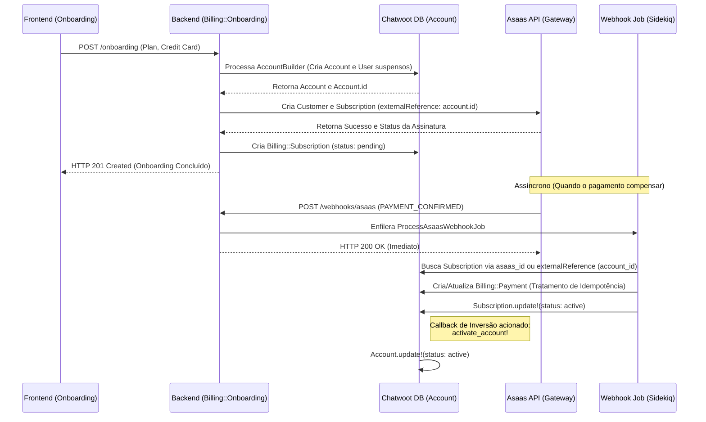

# Módulo de Faturamento e Onboarding (SaaS)

## 📌 Visão Geral
O **Módulo de Faturamento (Billing)** é um sistema multi-tenant isolado construído na arquitetura de *Rails Engine*, projetado para orquestrar o ciclo financeiro da plataforma Chatwoot (BeClinic). 
Diferente da lógica nativa do core, todas as entidades são apartadas do sistema raiz, delegando à entidade **Subscription** o controle absoluto (Source of Truth) de estado e suspensão da conta do cliente.

A integração financeira atual está estabelecida com a plataforma de pagamentos **Asaas**.

## 🏗 Arquitetura e Modelagem

O módulo opera de maneira injetada em `/plugins/billing`, isolando as implementações para não causar quebras no sistema principal.

- **`Billing::Customer`**: Representa um de-para do cliente real com o ID retornado do gateway de pagamento (Asaas), suportando validade de `cpf_cnpj`.
- **`Billing::Subscription`**: Ponto nevrálgico financeiro (`Source of Truth`). É vinculada de 1:1 ao `Account` central do usuário. Possui status rígidos (`pending`, `active`, `overdue`, `canceled`, `lead`). Todo e qualquer acesso de um usuário ao sistema em si é validado por este model.
- **`Billing::Payment`**: Guarda os registros individuais unívocos de transações de pagamento (cobrancas, boletos) e suas respectivas expirações e validações do gateway.

## ⚙️ Middleware e Segurança (`Billing::AccessControl`)

Para proteger o acesso ao sistema sem alterar os *Models* originais da base, utilizamos um Middleware em runtime atracado ao *Lifecycle* base de cada Request Autenticada.

- O middleware avalia se o Client tem uma Subscription ativa (`active`, `trial`, ou `lead`).
- Qualquer rota tentada com sistema em debito/suspenso é abortada devolvendo explicitamente um **HTTP 402 Payment Required**;
- Rotas públicas (como cadastro de API `onboarding` e `webhooks`) dispõem de *Whitelist* nativa para bypass dinâmico.

## 🚀 Fluxo de Onboarding (API)
- **Rota:** `POST /api/v1/billing/onboarding`
- **Sincronicidade:** **Síncrono** com Resiliência. O processo cria a estrutura do Chatwoot (Users, AccountBase), avança na conexão com o Gateway Asaas para garantir o Cartão, salva os registros em banco e injeta o ID local sob os metadados Asaas (`externalReference`) com retentativas baseadas em Faraday Middlewares.

### Arquitetura de Fluxo (Onboarding & Webhook)



### Payload de Exemplo:
```json
{
  "selected_plan": "standard",
  "name": "Clínica Teste",
  "email": "contato@clinica.com",
  "cpf_cnpj": "12345678000199",
  "phone": "5511999999999",
  "creditCard": {
    "holderName": "Joao da Silva",
    "number": "0000000000000000",
    "expiryMonth": "12",
    "expiryYear": "2028",
    "ccv": "123"
  },
  ...
}
```

## 🔄 Fluxo de Webhooks (Idempotência e Resiliência)
A conexão de callback do Asaas é tolerante a falhas pesadas.
- **Rota:** `POST /api/v1/billing/webhooks/asaas`
- **Processamento Background**: As requisições retornam imediatamente um status HTTP 200, empilhando o JSON cru por tráfego de Sidekiq `ProcessAsaasWebhookJob` com filas seguras.

### Idempotência e Tratamento de Concorrência
O model `Billing::Payment` utiliza `find_or_initialize_by` acoplado de um mapa de evolução de prioridades:
```ruby
STATUS_PRIORITY = { 'PENDING' => 1, 'RECEIVED' => 2, 'CONFIRMED' => 3, 'OVERDUE' => 4 }
```
Dessa forma:
1. Re-processamentos simultâneos sobre um mesmo Pagamento *(ex: `asaas_payment_id` colidente)* da plataforma não causam duplicidade de faturamento em Banco.
2. Webhooks corrompidos ou em delay temporal (um PENDING que chega duas horas depois que o CONFIRMED chegou primeiro) são ignorados pois o sistema preserva hierarquia nativa ascendente.

## 🏢 Enterprise Plan (Casos Leads)
Quando é interceptada no payload de onboarding a constante "enterprise":
- As execuções do Gateway Asaas são ignoradas em prol de salvar ciclos e falsos positivos de fraude.
- O Sistema materializa o modelo principal Chatwoot e apenda a Subscription sob a *Flag* enum `:lead`. O prospect continua travado para acesso ao painel, aguardando follow funcional do time Operacional/Comercial.
