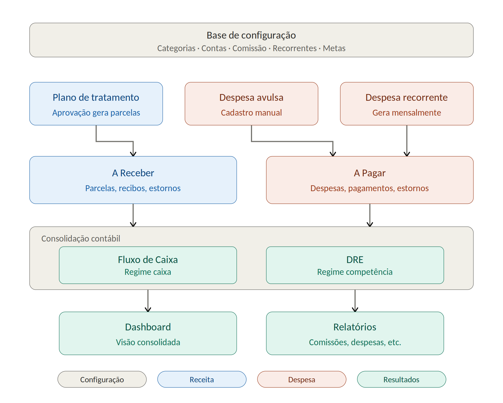
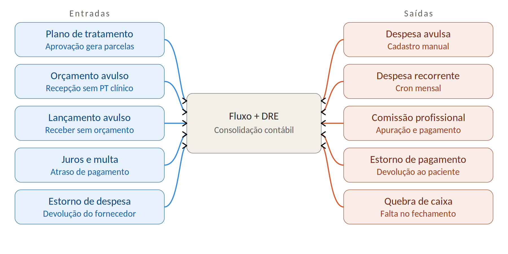

# Documento mestre — Financeiro Klivy/Salus

> Como o módulo financeiro funciona, como as telas conversam, como importar da Clinicorp.
> 
> Convertido de: `Financeiro_Klivy_Mestre.docx`  
> Última atualização: maio de 2026

---

# PARTE 1 — Propósito e como ler

Este documento descreve como o módulo financeiro do Klivy / Salus deve funcionar — quem dispara cada movimento, como as telas conversam entre si, e o que precisa estar configurado antes de qualquer importação da Clinicorp. É a referência única para a equipe de desenvolvimento e para a clínica entenderem o sistema de ponta a ponta.

## Quem usa este documento

A equipe de desenvolvimento usa para alinhar implementação, validar tickets do backlog e tirar dúvidas sobre o comportamento esperado. A clínica usa como manual de treinamento da recepção, profissionais e gestor. O contador externo usa para entender o que cada tela e relatório representam.

## Como ler

O documento está organizado em seis partes:

1.  Parte 1 — esta. Propósito e organização.

2.  Parte 2 — Mapa geral. Visão em camadas: configuração, origens, operacional, consolidação, visualização.

3.  Parte 3 — As 8 origens de movimento. Cada caminho que cria entrada ou saída no financeiro.

4.  Parte 4 — Funcionalidades por tela. O que cada tela faz e como conversa com as demais.

5.  Parte 5 — Importação da Clinicorp. Decisões e cuidados específicos da migração.

6.  Parte 6 — Regras transversais. Princípios técnicos e operacionais que valem para todo o módulo.

7.  Glossário — vocabulário do financeiro odontológico no contexto Klivy.

# PARTE 2 — Mapa geral em camadas

O financeiro do Klivy é organizado em cinco camadas. Cada camada depende da anterior: a base sustenta as origens, as origens alimentam o operacional, o operacional gera a consolidação, e a consolidação alimenta a visualização. Este diagrama é o mapa de referência para todas as conversas técnicas e funcionais subsequentes.

## Camada 0 — Base de configuração

Sustenta tudo. Cinco grupos de configuração precisam estar populados antes que qualquer movimento financeiro ocorra. Sem isso, lançamentos caem em "Sem categoria" e o DRE fica inútil.

| **Grupo**            | **O que define**                                                                                                               |
|----------------------|--------------------------------------------------------------------------------------------------------------------------------|
| Categorias           | Plano de contas: tipos de receita, despesa fixa, custo variável, outras. Define como o lançamento aparece no DRE.              |
| Contas bancárias     | Conta corrente PJ, caixa físico, conta da maquininha. Cada lançamento tem que apontar para uma.                                |
| Regras de comissão   | Por profissional: % sobre recebido, base bruta ou líquida. Define como a comissão é calculada quando o pagamento é confirmado. |
| Despesas recorrentes | Aluguel, sistema, internet, contador. Cron mensal gera as despesas no A Pagar automaticamente.                                 |
| Metas                | Receita mensal, trimestral, anual. Usadas pelo gauge do Dashboard.                                                             |

## Camada 1 — Origens

São os pontos de entrada de movimento financeiro. O diagrama acima mostra três para simplificar a leitura geral, mas a Parte 3 detalha as oito origens reais (incluindo lançamentos no paciente, comissão automática, reversões e movimentos internos do caixa).

## Camada 2 — Operacional (A Receber e A Pagar)

É onde a recepção trabalha o dia a dia. A Receber gerencia parcelas a receber, recebimentos confirmados e estornos. A Pagar gerencia despesas pendentes, pagamentos efetuados e estornos. Cada operação dispara em transação atômica os efeitos colaterais nas camadas abaixo.

## Camada 3 — Consolidação contábil (Fluxo de Caixa e DRE)

O mesmo evento financeiro é registrado de duas formas diferentes. O Fluxo de Caixa enxerga pela data efetiva (quando o dinheiro entrou ou saiu da conta) — regime caixa. O DRE enxerga pela data de competência (quando a receita ou despesa foi gerada) — regime competência. Por isso recebimento de parcela vencida pode aparecer em datas diferentes nas duas telas. Não é bug, é correto.

## Camada 4 — Visualização (Dashboard e Relatórios)

Apenas leitura. Dashboard agrega cards do dia para visão executiva rápida. Relatórios fatia por profissional, categoria, convênio e ticket médio para análises mais profundas. Nenhuma das duas escreve dados — todas as alterações partem de uma das origens da Parte 3.

# PARTE 3 — As 8 origens de movimento

Todo dinheiro que entra ou sai do sistema vem de uma destas oito origens. Se um lançamento aparece sem origem identificada, é bug de origem fantasma — investigar imediatamente. O diagrama abaixo mostra o lado das entradas (esquerda, azul) e o lado das saídas (direita, coral) convergindo na consolidação contábil.

## 1ª origem — Prontuário (Plano de Tratamento)

É o caminho principal. Cobre cerca de 90% das receitas da clínica.

O profissional (ou quem tiver permissão modular — pode ser o dentista, a recepção ou o financeiro, conforme a clínica definir) cria um plano de tratamento dentro do prontuário do paciente. Adiciona os procedimentos com valor padrão da tabela ou valor manual. Exemplo: limpeza R\$ 200 + restauração R\$ 500 = R\$ 700 a coletar.

Quando aprovado, o sistema gera as parcelas em A Receber automaticamente — número de parcelas, vencimento e forma definidos no momento da aprovação. Para casos como entrada + parcelas com valores diferentes, usar o modo personalizado ("parcelas com condições diferentes") que aceita uma lista heterogênea: cada parcela com seu próprio valor, vencimento e forma de pagamento.

Vínculo bidirecional automático — o lançamento aparece simultaneamente:

- Na aba Plano de Tratamento do prontuário (com status financeiro).

- Na aba Financeiro do paciente (lançamento detalhado).

- Em A Receber do menu Financeiro global (parcelas).

- No Fluxo de Caixa em previsão (regime caixa) e no DRE (regime competência).

## 2ª origem — Financeiro do paciente (lançamento direto)

Dentro da aba Financeiro do paciente (versão consolidada), três botões abrem três caminhos diferentes de criação de movimento. Todos vinculam ao paciente automaticamente, porque acontecem dentro da ficha dele.

### Adicionar Lançamento

Lançamento avulso de valor único — tipicamente entrada (paciente comprou produto, pagou taxa de cancelamento, venda de serviço extra). Em casos raros pode ser saída (devolução). Não cria orçamento separado, é registrado diretamente como movimento na ficha.

### Adicionar Mensalidades

Parcelamento avulso sem PT clínico associado. Útil quando o paciente quer parcelar uma compra avulsa em N vezes (ex.: kit de higiene em 3x). Gera N parcelas em A Receber com vencimentos sequenciais.

### Receber Pagamento

Tem dois sub-fluxos:

- Selecionar uma parcela existente (de PT ou de Mensalidade) e dar baixa nela.

- Receber valor sem parcela vinculada — o valor pode virar Crédito do paciente (saldo a favor) ou ser categorizado como receita avulsa imediata.

# PARTE 4 — Funcionalidades por tela

Esta parte detalha cada uma das 13 telas do módulo financeiro. Para cada uma: o que faz, quem usa, elementos principais, como conversa com as outras telas, e quais permissões se aplicam. As telas são agrupadas em quatro grupos: configuração, operacional, consolidação e visualização.

## Grupo A — Configurações

Cinco abas em Financeiro → Configurações. Não são telas de uso diário, mas precisam estar populadas antes que o módulo funcione. Acesso típico: ADMIN ou GERENTE.

### 4.1 — Configurações → Categorias

Cadastro do plano de contas. Define como o lançamento aparece no DRE.

| **Item**     | **Detalhe**                                                                                                                                                                                                         |
|--------------|---------------------------------------------------------------------------------------------------------------------------------------------------------------------------------------------------------------------|
| O que tem    | Lista de categorias com nome, tipo (Receita / Despesa Fixa / Custo Variável / Outra Despesa) e ativa/inativa. Botões: Nova categoria, Editar, Inativar.                                                             |
| Conversa com | DRE (agrupamento), A Pagar (seleção ao cadastrar despesa), Fluxo de Caixa (seleção ao lançar manual), Relatório → Despesas por Categoria.                                                                           |
| Regras       | Não permite duas categorias iguais do mesmo tipo. Não permite excluir categoria com lançamentos vinculados — oferece migrar primeiro. Categoria "Sem categoria" (default seed) não pode ser excluída nem renomeada. |
| Permissão    | Leitura: todos. Escrita: GERENTE, ADMIN.                                                                                                                                                                            |

### 4.2 — Configurações → Contas Bancárias

Cadastro das contas onde o dinheiro entra e sai. Inclui caixa físico e conta de maquininha.

| **Item**              | **Detalhe**                                                                                                                                             |
|-----------------------|---------------------------------------------------------------------------------------------------------------------------------------------------------|
| Tipos de conta        | CHECKING (conta corrente), SAVINGS (poupança), CASH (caixa físico), CARD_RECEIVABLE (a receber de maquininha — modela D+1 ou D+30).                     |
| Saldo                 | Cada conta tem saldo inicial (editável só na criação) e saldo atual (calculado: inicial + Σ entradas − Σ saídas). Nunca armazenado, sempre recalculado. |
| Transferência interna | Tela permite transferir entre contas — gera 2 lançamentos marcados como TRANSFER (saída na origem, entrada no destino). TRANSFER não soma no DRE.       |
| Conversa com          | Fluxo de Caixa (saldo total), A Receber (destino do recebimento), A Pagar (origem do pagamento), Caixa (caixa físico é uma BankAccount type=CASH).      |
| Permissão             | Leitura: todos. Escrita: ADMIN. Criação de transferência: GERENTE, ADMIN.                                                                               |

### 4.3 — Configurações → Regras de Comissão

Define como a comissão é calculada para cada profissional.

| **Item**                | **Detalhe**                                                                                                                             |
|-------------------------|-----------------------------------------------------------------------------------------------------------------------------------------|
| Modelo                  | Por profissional, uma ou mais regras com vigência (validFrom, validTo). Regra mais recente vigente na data do recebimento é a aplicada. |
| Tipos de regra          | % fixo geral, % por procedimento, % por especialidade. Base de cálculo: bruta ou líquida (descontando MDR de cartão e/ou laboratório).  |
| Imutabilidade histórica | Mudança de regra NÃO altera comissões já calculadas. Apenas afeta recebimentos futuros. Histórico preservado para auditoria.            |
| Conversa com            | Recebimento de pagamento (calcula comissão automaticamente), Relatório → Comissões.                                                     |
| Permissão               | Apenas ADMIN.                                                                                                                           |

### 4.4 — Configurações → Despesas Recorrentes

Modelo de despesas que se repetem mensalmente (ou em outra periodicidade).

| **Item**       | **Detalhe**                                                                                                                                                                                                                          |
|----------------|--------------------------------------------------------------------------------------------------------------------------------------------------------------------------------------------------------------------------------------|
| O que cadastra | Nome, categoria padrão, conta padrão, valor (fixo ou variável), dia do vencimento, periodicidade (mensal/bimestral/trimestral/anual), vigência (início, fim opcional).                                                               |
| Cron diário    | Roda às 00:01 todo dia. Para cada recorrente ativa, gera as despesas para os próximos 35 dias — sempre 1 mês adiantado para o usuário ver no A Pagar. É idempotente: se já existe despesa para aquela competência, não cria de novo. |
| Edição         | Editar valor afeta apenas competências futuras. As já geradas ficam preservadas. Inativar não exclui despesas existentes — só para de gerar novas.                                                                                   |
| Conversa com   | A Pagar (recebe as despesas geradas pelo cron). Categorias e Contas (referência).                                                                                                                                                    |
| Permissão      | GERENTE, ADMIN.                                                                                                                                                                                                                      |

### 4.5 — Configurações → Metas

Metas de receita usadas pelo gauge do Dashboard.

| **Item**          | **Detalhe**                                                                                       |
|-------------------|---------------------------------------------------------------------------------------------------|
| O que cadastra    | Três metas independentes: mensal, trimestral e anual. Valor em reais.                             |
| Edição retroativa | Permitida. Ajustar a meta no meio do mês recalcula o gauge imediatamente.                         |
| Quando vazio      | Se meta = 0, Dashboard oculta o gauge e mostra CTA "Cadastre uma meta para acompanhar progresso". |
| Conversa com      | Dashboard (gauge "Receita vs Meta").                                                              |
| Permissão         | GERENTE, ADMIN.                                                                                   |

## Grupo B — Operacional

Telas do dia a dia da recepção e do financeiro. A maior parte das ações do módulo acontecem aqui.

### 4.6 — A Receber

Lista de tudo a receber e tudo já recebido. Coração do dia a dia da recepção.

| **Item**        | **Detalhe**                                                                                                                                                                                   |
|-----------------|-----------------------------------------------------------------------------------------------------------------------------------------------------------------------------------------------|
| Cards (4)       | Total a Receber, Recebido, Vencido, Transações. Calculados em tempo real conforme filtro de período.                                                                                          |
| Tabela          | Descrição (paciente + parcela), Valor, Vencimento, Recebido em, Forma, Status, Ações. Ordenação clicável.                                                                                     |
| Filtros         | Descrição (busca), período, status (Pendente/Recebido/Vencido/Estornado/Cancelado), forma de pagamento.                                                                                       |
| Ações por linha | Editar parcela (se PENDING), Receber pagamento, Estornar (se RECEIVED), Visualizar PT/Orçamento de origem.                                                                                    |
| Botões topo     | Nova Entrada (atalho para lançamento avulso), Gerar PDF (extrato do período).                                                                                                                 |
| Conversa com    | Plano de Tratamento (origem das parcelas), Financeiro do Paciente (espelho), Caixa (recebimentos em dinheiro), Comissão (calcula ao receber), DRE (regime competência), Fluxo (regime caixa). |
| Permissão       | Leitura: todos com acesso ao financeiro. Receber pagamento: RECEPCAO, GERENTE, ADMIN. Estornar: GERENTE, ADMIN.                                                                               |

### 4.7 — A Pagar

Espelho de A Receber, mas para saídas.

| **Item**        | **Detalhe**                                                                                                          |
|-----------------|----------------------------------------------------------------------------------------------------------------------|
| Cards (4)       | Total a Pagar, Total Recorrente, Próximos a Vencer (3 dias), Transações.                                             |
| Tabela          | Descrição, Categoria, Vencimento, Valor, Conta, Status, Ações.                                                       |
| Filtros         | Descrição, período, categoria, conta, status, "Apenas vencidos".                                                     |
| Ações por linha | Editar despesa, Pagar (gera saída), Estornar (se PAID), Excluir (se PENDING).                                        |
| Botões topo     | Nova Despesa, Gerar PDF.                                                                                             |
| Conversa com    | Despesas Recorrentes (origem das geradas pelo cron), Categorias, Contas, DRE, Fluxo, Caixa (pagamentos em dinheiro). |
| Permissão       | Cadastrar e pagar: RECEPCAO, GERENTE, ADMIN. Estornar: GERENTE, ADMIN. Excluir despesa paga: ADMIN.                  |

### 4.8 — Caixa (sessão diária)

Rastreia especificamente o dinheiro em espécie. PIX, cartão e boleto vão direto para suas contas bancárias e não passam por aqui. O Caixa físico é uma das contas (BankAccount type=CASH) com a particularidade de ter sessão diária (abertura → fechamento).

| **Item**     | **Detalhe**                                                                                                                                                                                                       |
|--------------|-------------------------------------------------------------------------------------------------------------------------------------------------------------------------------------------------------------------|
| Abertura     | Recepcionista digita saldo inicial em dinheiro. Cria CashRegister status=OPEN. Apenas 1 caixa aberto por dia. Aba Histórico lista as sessões anteriores.                                                          |
| Sangria      | Tirar dinheiro do caixa para depositar em conta bancária. Movimento neutro no DRE. Caixa diminui, banco aumenta.                                                                                                  |
| Suprimento   | Inverso. Pegar dinheiro do banco e colocar no caixa para troco. Banco diminui, caixa aumenta. Também neutro no DRE.                                                                                               |
| Fechamento   | Recepcionista conta o dinheiro. Sistema mostra o esperado (abertura + entradas − saídas − sangrias + suprimentos). Diferença é registrada como Quebra de Caixa: falta → Outras Despesas, sobra → Outras Receitas. |
| Reabertura   | Permitida para GERENTE/ADMIN com motivo obrigatório. Permite ajuste retroativo. Histórico mantém todos os fechamentos.                                                                                            |
| Bloqueio     | Lançamento em dinheiro com data em caixa fechado retorna erro pedindo reabrir antes.                                                                                                                              |
| Conversa com | Fluxo de Caixa (movimentos da sessão), DRE (quebra de caixa), Contas (saldo do caixa físico).                                                                                                                     |
| Permissão    | Abrir/fechar/sangria/suprimento: RECEPCAO, GERENTE, ADMIN. Reabrir: GERENTE, ADMIN.                                                                                                                               |

### 4.9 — Financeiro do paciente (aba do prontuário)

Aba consolidada dentro do prontuário. Reformulada conforme proposta — uma única visão com todos os lançamentos do paciente, sem sub-abas. Substitui as quatro sub-abas anteriores (Transações / Orçamentos / Plano de Tratamento / Recibos) por uma tabela única com origem identificada em cada linha.

| **Item**         | **Detalhe**                                                                                                                                                                  |
|------------------|------------------------------------------------------------------------------------------------------------------------------------------------------------------------------|
| Cards (5)        | Total Aprovado, Pago/Recebido, Em Aberto, Devedor (Vencido), Crédito.                                                                                                        |
| Botões topo      | Novo Orçamento, Adicionar Lançamento, Adicionar Mensalidades, Receber Pagamento. Permissão modular por botão.                                                                |
| Tabela única     | Cada linha um lançamento. Colunas: Data, Descrição + Origem (link clicável para o PT/Orçamento), Valor, Saldo, Forma, Parcelas (bolinhas numeradas indicando status), Ações. |
| Filtros          | Todos / Pendentes / Pagos / Vencidos / Estornados.                                                                                                                           |
| Ações por linha  | Editar lançamento, Cancelar pagamento (estornar), Gerar recibo, Ver parcelas (drill-down), Visualizar PT/Orçamento, Excluir lançamento (ADMIN, sem parcela paga).            |
| Indicador visual | Bolinhas numeradas das parcelas: azul preenchida = paga, contorno cinza = pendente, contorno vermelho = vencida. Bater olho na linha já dá pra saber em que pé está.         |
| Conversa com     | Plano de Tratamento (origem clicável), A Receber global (espelho), Fluxo de Caixa (recebimentos), Caixa (dinheiro), Crédito do paciente (saldo).                             |
| Permissão        | Visualizar: todos com acesso ao prontuário do paciente. Botões individuais: configurável modular conforme política da clínica.                                               |

# PARTE 5 — Importação da Clinicorp

A clínica está migrando 11 arquivos da Clinicorp. Esta parte resume as decisões da migração que afetam o funcionamento normal do módulo após o go-live. O passo a passo operacional completo está no documento Guia de Importação Clinicorp para Klivy (entregue separadamente).

## Resumo dos números

| **O que migra**                     | **Volume**                                  |
|-------------------------------------|---------------------------------------------|
| Profissionais ativos                | 8 (de 9 cadastrados)                        |
| Pacientes ativos                    | 2.407 (de 2.559 cadastrados)                |
| Templates de anamnese               | 3 templates · 44 perguntas · 600 respostas  |
| Agendamentos                        | 8.745 (jul/2023 a jan/2027), 346 cancelados |
| Procedimentos clínicos no histórico | 9.617 (registros executados)                |
| Orçamentos abertos                  | ≤ 34                                        |
| Cobranças (cabeçalhos)              | 1.766                                       |
| Parcelas ativas                     | 2.216                                       |
| Total lançado historicamente        | R\$ 537.794,90                              |
| Total recebido historicamente       | R\$ 445.025,75                              |
| Saldo a receber líquido             | R\$ 92.769,15                               |

## Decisões importantes da migração que afetam o funcionamento

### Plano de Tratamento clínico não existe na Clinicorp

A Clinicorp tem apenas a entidade Budget (orçamento). Não tem o conceito de Plano de Tratamento clínico como o Klivy tem. Por isso, todos os 34 orçamentos importados entram como Orçamento no Klivy, NÃO como Plano de Tratamento.

O Plano de Tratamento clínico do Klivy começa do zero pós go-live. Os profissionais criam novos PTs conforme atendem os pacientes. Histórico clínico antigo (procedimentos já executados) fica visível na aba Evolução do prontuário, mas não vira PT retroativamente.

### Forma de pagamento OTHER da Clinicorp = Dinheiro no Klivy

A Clinicorp não distingue Dinheiro de PIX — ambos são exportados como type="OTHER" (1.167 itens, 51% do total). Por padrão, o importador mapeia OTHER para Dinheiro no Klivy. Após a importação, o gerente deve usar a tela "Reclassificação em massa" (filtro por valor — geralmente acima de R\$ 200 é PIX) para corrigir a forma de pagamento dos itens que eram PIX.

# PARTE 6 — Regras transversais

Princípios que valem para TODAS as origens, telas e operações do módulo financeiro. Servem como base para qualquer dúvida funcional ou técnica que aparecer durante a operação ou o desenvolvimento.

## Vínculo bidirecional paciente ↔ financeiro geral

Quando um lançamento tem paciente vinculado (origens 1, 2 e parte da 3 da Parte 3), os dois "controles" sempre mostram o mesmo dado em tempo real. Recebimento na aba Financeiro do paciente atualiza A Receber global. Recebimento em A Receber global atualiza a aba Financeiro do paciente. Não existem dados "duplicados" — é a mesma entidade vista de dois lugares diferentes.

## Regime caixa vs regime competência

A mesma origem alimenta os dois regimes simultaneamente. Cada lançamento financeiro tem dois campos de data:

- competenceDate — quando a receita ou despesa foi gerada (ex.: data da aprovação do orçamento, data do vencimento da despesa).

- cashDate — quando o dinheiro efetivamente entrou ou saiu da conta (ex.: data do recebimento, data do pagamento).

Fluxo de Caixa filtra por cashDate. DRE filtra por competenceDate. Por isso uma parcela vencida em janeiro e paga em março aparece em janeiro no DRE e em março no Fluxo de Caixa. Isso é correto — não é bug. Reflete a diferença real entre "o que a clínica gerou" e "o que ela recebeu".

## Permissão modular

Cada operação tem permissão configurável por perfil. A clínica decide a política. Cinco perfis cobrem 100% dos casos:

| **Perfil** | **Tipicamente**                                                                                                                                                |
|------------|----------------------------------------------------------------------------------------------------------------------------------------------------------------|
| RECEPCAO   | Recepcionistas. Lança entrada/saída avulsa, baixa parcela, abre/fecha caixa, faz sangria. NÃO estorna, NÃO exclui despesa paga, NÃO vê DRE.                    |
| DENTIST    | Profissionais. Vê próprio relatório de comissão, cria e aprova plano de tratamento (se a clínica autorizar). NÃO vê dados financeiros de outros profissionais. |
| GERENTE    | Coordenação. Tudo de RECEPCAO + estorna, exclui despesa, vê DRE/Relatórios, reabre caixa, configura categorias e contas. NÃO altera regras de comissão.        |
| ADMIN      | Dono ou TI. Tudo. Único que altera regras de comissão, faz importações, gera backup, acessa logs.                                                              |
| AUDITOR    | Contador externo, somente leitura. Lê tudo (DRE, Fluxo, A Receber, A Pagar, Relatórios). NÃO escreve nada.                                                     |

## Categorização obrigatória

Todo lançamento precisa cair em uma categoria do plano de contas. Sem categoria cadastrada, o lançamento vai para "Sem categoria" e o DRE fica inútil. Por isso o wizard de configuração inicial é obrigatório antes de liberar o módulo. O wizard força criar pelo menos uma categoria de cada tipo, pelo menos uma conta bancária + caixa físico, e pelo menos uma regra de comissão por profissional ativo.

## Idempotência

Toda ação de escrita é idempotente. Duplo clique em "Receber pagamento" ou "Salvar despesa" nunca duplica o lançamento. Tecnicamente, o frontend gera uma chave UUID no momento do clique e envia em todas as ações. O servidor armazena (chave, resposta) por 24 horas. Mesma chave devolve mesma resposta sem reprocessar. Resolve duplicidade tanto na operação manual quanto em retentativas de importação.

## Soft delete + audit log

Nenhuma entidade financeira é deletada fisicamente. Todo "excluir" marca a entidade como deletedAt + deletedBy. Listagens normais filtram automaticamente. Existe view "Histórico/Lixeira" para ADMIN e AUDITOR. Toda mudança de estado também grava em AuditLog: quem fez, quando, IP, valor antes, valor depois. ADMIN e AUDITOR podem exportar logs em CSV por período.

## Atomicidade dos efeitos múltiplos

Operações que afetam vários módulos rodam em transação de banco. Falha em qualquer passo desfaz tudo. Exemplo: "Receber pagamento" toca em sete destinos (parcela, saldo da conta, lançamento no Fluxo, comissão, status do paciente, card do paciente, DRE). Se a atualização da comissão falhar, parcela volta para Pendente, saldo volta, lançamento é desfeito. Garante consistência mesmo em casos de falha de rede ou erro de banco.

## Valores em centavos

Todos os valores monetários são armazenados como inteiros em centavos (BIGINT). Nunca como float. Resolve perda por arredondamento. Quando o sistema divide um valor em N parcelas, distribui o resto na última parcela. Exemplo: R\$ 920 ÷ 3 = R\$ 306,66 + R\$ 306,66 + R\$ 306,68 (não R\$ 306,67 três vezes). Frontend formata sempre com locale pt-BR e moeda BRL.

# PARTE 6.5 — Módulos de configuração e fechamento (addendum 2026-05-30)

> Addendum da auditoria de APIs de 2026-05-30. Estes cinco módulos já estão implementados e roteados (`financial/v2/*`), mas não eram descritos nas partes acima. Contrato REST detalhado na documentação OpenAPI (`swagger/plugins_index.yml`).

## 6.5.1 — Mensalidade fixa (RecurringBilling)

O **motor real** das mensalidades é `Financial::RecurringBilling` — distinto do `Budget(origin=mensalidade)` legado (que é apenas um rótulo de orçamento). Uma mensalidade fixa ativa, cujo `next_generation_at` chegou, é processada pelo job `GenerateRecurringBillingsJob` (02:30 UTC): gera um `Budget(aprovado, origin=mensalidade_recorrente)` + 1 `BudgetItem` + 1 `Installment` por período, provisiona comissão e avança `next_generation_at`. **Não auto-recebe** (não há operador no momento da geração) — cartões com baixa automática são captados depois pelo job de liquidação. Ações: criar, pausar, retomar, cancelar. RBAC: RECEPCAO/GERENTE/ADMIN para escrita. Idempotência obrigatória na criação.

## 6.5.2 — Formas de pagamento e taxas (PaymentMethod + PaymentMethodFee)

Cadastro central das **formas de pagamento** (Dinheiro, PIX, Débito, Crédito, Boleto, etc.) e suas **taxas (MDR) versionadas**. As taxas são imutáveis após criadas — em vez de editar, cria-se uma nova vigência e desativa a anterior (mantém histórico para recálculo correto de comissão). Cada forma tem `settlement_mode` que controla a **baixa automática**: `manual` (operador clica), `on_confirm` (recebido na aprovação do orçamento), `on_due_date` (liquidado no vencimento pelo `AutoSettleCardInstallmentsJob`, só para crédito/débito — boleto/convênio/parcelamento próprio nunca usam on_due_date). O `kind` da forma é imutável após criação. RBAC: criação/edição/remoção exigem ADMIN/GERENTE. **Exceção a corrigir:** a ação `rename_provider` hoje não tem gate de role.

## 6.5.3 — Precificação de serviços (ServicePricing)

`Financial::ServicePricing` tem relação 1-para-1 com `::AgendaService` (FK `agenda_service_id`). Define preço, categoria DRE, comissão padrão e código TUSS de cada serviço — o nome e a duração ficam na Agenda. **Sem ServicePricing, o serviço não pode ser lançado financeiramente.** Na API, o `:id` da URL é o `agenda_service_id` (não o id do pricing). Upsert (PUT) cria (201) ou atualiza (200). RBAC: ADMIN/GERENTE para escrita.

## 6.5.4 — Perfil de comissionado (AgentProfile)

`Financial::AgentProfile` tem relação 1-para-1 com `::User` — é o vínculo trabalhista/comissionável do profissional (CPF, CRO, dados bancários). Por conter **dados bancários sensíveis**, upsert e desativação são **ADMIN-only**. Na API, o `:id` da URL é o `user_id`. Desativar o profile não remove o User.

## 6.5.5 — Fechamento de período (PeriodClosure)

`Financial::PeriodClosure` é o **fechamento contábil append-only**: o ADMIN fecha um mês e, a partir daí, lançamentos/despesas/parcelas daquele período de competência não podem mais ser editados (`Errors::PeriodClosed` → HTTP 423 Locked). Soft delete (LGPD) continua permitido. Reabrir um período exige motivo (`reopen`, ADMIN). O recebimento de pagamento também é bloqueado em mês fechado.

# PARTE 7 — Glossário

Vocabulário do financeiro odontológico no contexto Klivy.

| **Termo**                      | **Definição**                                                                                                                                                                                                                                     |
|--------------------------------|---------------------------------------------------------------------------------------------------------------------------------------------------------------------------------------------------------------------------------------------------|
| Plano de Tratamento (PT)       | Documento clínico criado pelo profissional no prontuário do paciente. Contém procedimentos a executar com valores. Quando aprovado, gera as parcelas em A Receber.                                                                                |
| Orçamento                      | Documento financeiro avulso, criado fora do contexto clínico (recepção, sem PT). Pode incluir produtos, taxas, serviços extras. Quando aprovado, também gera parcelas.                                                                            |
| Parcela                        | Cada cobrança individual a receber. Pertence a um Plano de Tratamento, Orçamento, ou Mensalidade. Tem vencimento, valor, forma de pagamento e status (Pendente, Recebido, Vencido, Estornado, Cancelado).                                         |
| Lançamento                     | Termo geral para qualquer movimento financeiro registrado: recebimento, pagamento, transferência, sangria, suprimento, estorno. Cada lançamento tem origem identificada.                                                                          |
| Recibo                         | Documento gerado para o paciente comprovando o pagamento. Pode cobrir uma parcela ou várias parcelas no mesmo PaymentReceipt.                                                                                                                     |
| Estorno                        | Operação que cancela um recebimento ou pagamento já efetuado. Reverte saldo, gera lançamento de saída/entrada do dia atual (não retroativo), reverte comissão.                                                                                    |
| Cancelamento                   | Operação que invalida uma parcela ainda PENDING (não recebida). Diferente de estorno — não há nada a reverter, apenas a parcela é marcada como CANCELED.                                                                                          |
| Renegociação                   | Substitui parcelas vencidas por um novo conjunto de parcelas, geralmente com juros. As originais ficam com status RENEGOTIATED. Histórico mostra link entre original e renegociação.                                                              |
| Crédito do paciente            | Saldo a favor do paciente. Vem de estorno sem devolução, pré-pagamento ou pagamento maior que a parcela. Pode ser abatido em parcela futura ou sacado em dinheiro.                                                                                |
| Comissão                       | Valor devido ao profissional sobre os recebimentos atribuídos a ele. Calculada automaticamente conforme regra cadastrada. Tem status (Provisionada quando parcela está pendente, Devida quando recebida, Paga quando quitada com o profissional). |
| Sangria                        | Tirar dinheiro do caixa físico para depositar em conta bancária. Movimento neutro no DRE — é apenas transferência interna.                                                                                                                        |
| Suprimento                     | Inverso da sangria. Pegar dinheiro do banco e colocar no caixa físico, geralmente para troco no início do dia.                                                                                                                                    |
| Quebra de caixa                | Diferença detectada no fechamento do caixa físico entre o valor esperado pelo sistema e o valor efetivamente contado. Falta vai para Outras Despesas, sobra vai para Outras Receitas.                                                             |
| Regime caixa                   | Visão financeira pela data efetiva (quando o dinheiro entrou ou saiu da conta). Usado pelo Fluxo de Caixa.                                                                                                                                        |
| Regime competência             | Visão financeira pela data de geração (quando a receita foi gerada ou a despesa incorrida). Usado pelo DRE.                                                                                                                                       |
| Categoria financeira           | Item do plano de contas. Define como o lançamento aparece no DRE. Tem tipo (Receita / Despesa Fixa / Custo Variável / Outra Despesa).                                                                                                             |
| Conta bancária                 | Onde o dinheiro fica. Pode ser conta corrente PJ, poupança, caixa físico ou "a receber de maquininha". Tem saldo (calculado, nunca armazenado).                                                                                                   |
| Forma de pagamento             | Como o dinheiro mudou de mãos: Dinheiro, PIX, Débito, Crédito, Boleto, Múltiplas (entrada + parcelas com formas diferentes), Cheque, Transferência.                                                                                               |
| Idempotência                   | Propriedade de uma operação que produz o mesmo resultado se executada uma ou várias vezes. Garante que duplo clique não duplica lançamento.                                                                                                       |
| DRE                            | Demonstração do Resultado do Exercício. Relatório contábil que mostra receita, custos, despesas e lucro do período. No Klivy usa regime competência.                                                                                              |
| MDR                            | Merchant Discount Rate. Taxa cobrada pela operadora de cartão sobre cada venda no cartão. Pode ser descontada da base de cálculo da comissão se a regra do profissional definir.                                                                  |
| Wizard de configuração inicial | Tela obrigatória que aparece para o ADMIN no primeiro acesso ao módulo financeiro. Força configurar categorias, contas, regras de comissão, recorrentes e metas antes de liberar o uso.                                                           |

*Documento mestre. Atualizar conforme decisões evoluírem. Revisões devem ser comunicadas à equipe de desenvolvimento e à clínica simultaneamente.*
