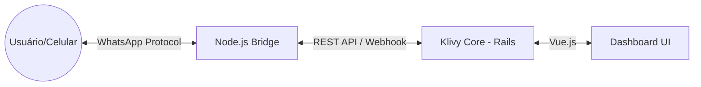

# 📱 WhatsApp QR Code Bridge — Documentação Técnica

> Este documento descreve a implementação do motor de conexão WhatsApp via QR Code (sem API oficial) utilizado no KlivyApp.
>
> **Última auditoria:** `2026-05-07`. Reflete o estado atual do código antes do isolamento em `plugins/whatsapp_qr` (ver `implementation-plan-whatsapp-qr-isolation.md`).

---

## 1. Visão Geral
O **WhatsApp QR Code Bridge** é um serviço satélite escrito em Node.js que permite ao KlivyApp se conectar a contas comuns do WhatsApp (pessoais ou business) através do escaneamento de um QR Code, simulando o comportamento do WhatsApp Web.

Diferente das integrações oficiais (Cloud API, Twilio), esta solução:
- **Custo Zero:** Não depende de cobranças por conversa da Meta.
- **Liberdade:** Permite usar qualquer número sem processo de aprovação de templates.
- **Protocolo:** Utiliza a biblioteca **Baileys** para comunicação via WebSockets com os servidores do WhatsApp.

---

## 2. Arquitetura
A funcionalidade opera em um modelo de **ponte bidirecional**:



### Componentes Chave (estado atual no repo):
1. **Motor Node.js:** `lib/whatsapp/server.js` (1658 linhas). Servidor Express que gerencia as sessões Baileys.
2. **Provider Service Ruby:** `app/services/whatsapp/providers/whatsapp_qr_service.rb` (183 linhas). Abstração no Rails para enviar comandos (texto, mídia) para a Bridge.
3. **Incoming Message Service:** `app/services/whatsapp/incoming_message_qr_service.rb` (402 linhas). Processa o payload recebido do webhook, deduplica, baixa mídia e cria mensagens no Chatwoot.
4. **Webhook Controller:** `app/controllers/webhooks/whatsapp_qr_controller.rb`. Endpoint `POST /webhooks/whatsapp_qr/:phone_number` que recebe notificações da Bridge. Faz lookup do canal por `phone_number` ou `own_number` e delega para o `IncomingMessageQrService`.
5. **Vue UI:**
   - `WhatsappQR.vue` (467 linhas) — tela de criação de inbox QR.
   - `WhatsappQRStatus.vue` (342 linhas) — painel de status (gera QR, mostra estado de conexão, botão de reset).

---

## 3. Funcionamento da Bridge (Node.js)

### Gerenciamento de Sessões
A Bridge é **multi-instância**. Cada "Caixa de Entrada" no KlivyApp corresponde a uma sessão isolada na Bridge, identificada pelo `inbox_id`.
- **Armazenamento:** As credenciais de autenticação são salvas em `lib/whatsapp/sessions/{inbox_id}/auth_info`.
- **Isolamento:** Se uma sessão cair ou for desconectada, as outras permanecem operacionais.
- **Persistência (produção):** No deploy Easypanel o diretório `lib/whatsapp/sessions` é montado a partir do volume Docker `/app/storage`. **Não remover esse volume** — sem ele, a sessão Baileys é perdida a cada redeploy e o usuário precisa rescanear o QR. Existe uma rotina de health-check + watchdog que valida o socket e re-conecta automaticamente quando a credencial está intacta (ver commit `19f47890`).
- **Isolamento futuro:** quando a migração para `plugins/whatsapp_qr/engine/` acontecer, o caminho deve ser parametrizável via env var `WHATSAPP_SESSIONS_DIR` (default `./sessions` relativo ao engine), e o volume Easypanel deve ser remapeado para o novo path.

### Endpoints da Bridge (Porta 3002):
- `GET /sessions/:id/status` — Retorna o estado atual (`connected`, `awaiting_qr`, `disconnected`, etc.).
- `GET /sessions/:id/qr` — Gera e retorna um novo QR Code em formato DataURL (Base64).
- `POST /sessions/:id/send` — Envia mensagens (suporta `text`, `image`, `audio`, `video`, `document`).
- `POST /sessions/:id/disconnect` — Força o logout e limpa os arquivos de sessão.
- `GET /health` — Health-check para o watchdog/Easypanel.

### Estado runtime adicional
Além de `sessions/`, a Bridge mantém no diretório do motor:
- `lid_map.json` — cache de resolução LID → JID (ver §6).
- `channel_config.json` — overrides de configuração por canal.
- `bridge.log` — log centralizado (gerado em runtime).
- `media_cache/` — mídias recebidas, limpas após 1h.

Os arquivos `.json` de estado **devem viver no volume persistente** junto com `sessions/`, não no diretório de código.

---

## 4. Fluxo de Mensagens

### Enviando (Outbound):
1. O agente digita uma mensagem no Chatwoot.
2. `Channel::Whatsapp#provider_service` retorna `Whatsapp::Providers::WhatsappQrService` quando `provider == 'whatsapp_qr'`.
3. O service dispara um `POST` para a Bridge no endpoint `/sessions/:id/send`.
4. A Bridge utiliza o socket ativo da sessão para despachar a mensagem ao WhatsApp.

### Recebendo (Inbound):
1. O WhatsApp envia um evento de nova mensagem via socket para a Bridge.
2. A Bridge baixa mídias (se houver) e armazena temporariamente em `lib/whatsapp/media_cache`.
3. A Bridge faz um `POST` para o webhook do KlivyApp:
   `${CHATWOOT_BASE_URL}/webhooks/whatsapp_qr/{phone_number}`
   com `own_number` no body para correlação.
4. `Webhooks::WhatsappQrController#process_payload` localiza o canal por `phone_number` ou `own_number` (com normalização de dígitos), atualiza `provider`/`phone_number` se necessário e delega para `Whatsapp::IncomingMessageQrService#perform`.
5. O service processa o payload, identifica contato/conversa, deduplica (via `MessageDedupLock`) e cria a mensagem no banco.

---

## 5. Operação e Debug

### Como iniciar localmente:
A Bridge é iniciada automaticamente pelo `overmind` ou `Procfile.dev` (linha 5):
```bash
# Procfile.dev
whatsapp: ./dev-tools/scripts/start_bridge.sh
```

O script `start_bridge.sh`:
- Mata processos zumbis em `:3002` (via `lsof`/`pkill`).
- Carrega `lib/whatsapp/env.localhost`.
- Executa `node server.js` com saída em `bridge.log`.

### Como instalar como serviço (VPS):
- `dev-tools/scripts/install_bridge_service.sh` — instala a unit `whatsapp-bridge.service` (systemd).
- `dev-tools/scripts/register_qr.sh` — helper de registro/CLI para sessões.

### Logs:
- Bridge: `lib/whatsapp/bridge.log` (rotativo).
- Rails: tags `[WHATSAPP_QR]` no log de desenvolvimento e produção.

### Problemas Comuns:
- **QR Code não carrega:** Verifique se o processo Node está rodando (`ps aux | grep server.js`) e se a porta 3002 está acessível.
- **Mensagens não chegam no Chatwoot:** Verifique se a variável `CHATWOOT_BASE_URL` (env do container da Bridge) aponta para o servidor Rails correto.
- **Sessão "presa":** Use o botão **"Forçar Reset Completo"** em `WhatsappQRStatus.vue` para limpar a pasta `auth_info` e gerar um novo QR.
- **Sessão perdida após redeploy:** sintoma de volume Easypanel desmontado. Verificar `/app/storage` no container.
- **Provider não bate:** O webhook controller força `update!(provider: 'whatsapp_qr')` quando recebe payload de inbox cujo provider divergiu — comportamento intencional para autocorrigir.

---

## 6. Considerações Técnicas
- **LID Resolution:** O motor possui lógica para resolver IDs de contato do tipo `LID` (novos identificadores do WhatsApp) para JIDs reais, persistida em `lid_map.json`, garantindo a integridade dos contatos no Chatwoot.
- **Phone Matching:** O webhook controller faz busca flexível por `phone_number` em variantes de formatação BR (com/sem `9` adicional, com/sem DDI), suportando os dois formatos comuns. Ver commit `6e0de90f`.
- **Group Avatar Sync:** Mensagens de grupo trazem o avatar sincronizado automaticamente.
- **Media Cache:** Mídias recebidas são limpas automaticamente da Bridge após 1 hora para economizar espaço em disco.
- **Dedup:** Mensagens recebidas passam por `Whatsapp::MessageDedupLock` (Redis) para evitar processamento duplicado em retries do webhook.
- **Multi-tenancy:** Sessões são isoladas por `inbox_id`, e cada inbox pertence a uma única `account`. A Bridge nunca cruza contas — ver `feedback_multi_tenant.md`.
- **Segurança:** A comunicação entre Rails e Bridge ocorre em rede privada (Easypanel internal network) ou via firewall. A Bridge não possui autenticação JWT própria — confia na origem.
- **Roadmap:** isolar todo o módulo (Bridge + serviços Ruby + componentes Vue) em `plugins/whatsapp_qr/` seguindo o padrão modular monolítico do KlivyApp. Ver `implementation-plan-whatsapp-qr-isolation.md`.
