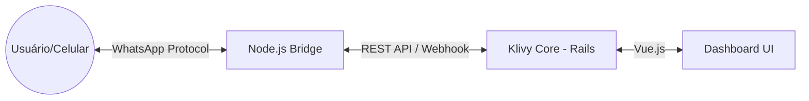

# 📱 WhatsApp QR Code Bridge — Documentação Técnica

> Este documento descreve a implementação do motor de conexão WhatsApp via QR Code (Sem API oficial) utilizado no KlivyApp.

---

## 1. Visão Geral
O **WhatsApp QR Code Bridge** é um serviço satélite escrito em Node.js que permite ao KlivyApp se conectar a contas comuns do WhatsApp (pessoais ou business) através do escaneamento de um QR Code, simulando o comportamento do WhatsApp Web.

Diferente das integrações oficiais (Cloud API, Twilio), esta solução:
- **Custo Zero:** Não depende de cobranças por conversa da Meta.
- **Liberdade:** Permite usar qualquer número sem processo de aprovação de templates.
- **Protocolo:** Utiliza a biblioteca **Baileys** para comunicação via WebSockets com os servidores do WhatsApp.

---

## 2. Arquitetura
A funcionalidade opera em um modelo de **ponte bidirecional**:



### Componentes Chave:
1.  **Motor Node.js (`lib/whatsapp/`):** Servidor Express que gerencia as sessões de socket.
2.  **Service Ruby (`app/services/whatsapp/providers/whatsapp_qr_service.rb`):** Abstração no Rails para enviar comandos (texto, mídia) para a Bridge.
3.  **Webhook Handler (`app/controllers/webhooks/whatsapp_qr_controller.rb`):** Recebe notificações de mensagens recebidas vindas da Bridge.
4.  **Vue UI (`WhatsappQRStatus.vue`):** Componente de interface para gerenciar a conexão e visualizar o QR Code.

---

## 3. Funcionamento da Bridge (Node.js)

### Gerenciamento de Sessões
A Bridge é **multi-instância**. Cada "Caixa de Entrada" no KlivyApp corresponde a uma sessão isolada na Bridge, identificada pelo `inbox_id`.
- **Armazenamento:** As credenciais de autenticação são salvas em `lib/whatsapp/sessions/{inbox_id}/auth_info`.
- **Isolamento:** Se uma sessão cair ou for desconectada, as outras permanecem operacionais.

### Endpoints da Bridge (Porta 3002):
- `GET /sessions/:id/status`: Retorna o estado atual (`connected`, `awaiting_qr`, etc).
- `GET /sessions/:id/qr`: Gera e retorna um novo QR Code em formato DataURL (Base64).
- `POST /sessions/:id/send`: Envia mensagens (suporta `text`, `image`, `audio`, `video`, `document`).
- `POST /sessions/:id/disconnect`: Força o logout e limpa os arquivos de sessão.

---

## 4. Fluxo de Mensagens

### Enviando (Outbound):
1. O agente digita uma mensagem no Chatwoot.
2. O `WhatsappQrService` dispara um POST para a Bridge no endpoint `/send`.
3. A Bridge utiliza o socket ativo da sessão para despachar a mensagem ao WhatsApp.

### Recebendo (Inbound):
1. O WhatsApp envia um evento de nova mensagem via socket para a Bridge.
2. A Bridge baixa mídias (se houver) e armazena temporariamente em `lib/whatsapp/media_cache`.
3. A Bridge faz um POST para o Webhook do KlivyApp: `/webhooks/whatsapp_qr/{phone_number}`.
4. O Rails processa o payload, identifica o contato/conversa e cria a mensagem no banco de dados.

---

## 5. Operação e Debug

### Como iniciar localmente:
A Bridge é iniciada automaticamente pelo `overmind` ou `Procfile.dev`:
```bash
# Script de inicialização
./dev-tools/scripts/start_bridge.sh
```

### Logs:
- Os logs da Bridge são centralizados no arquivo `lib/whatsapp/bridge.log`.
- No Rails, procure por tags `[WHATSAPP_QR]` no log de desenvolvimento.

### Problemas Comuns:
- **QR Code não carrega:** Verifique se o processo Node está rodando (`ps aux | grep server.js`) e se a porta 3002 está acessível.
- **Mensagens não chegam no Chatwoot:** Verifique se a variável de ambiente `CHATWOOT_BASE_URL` na Bridge está apontando corretamente para o servidor Rails.
- **Sessão "Presa":** Use o botão **"Forçar Reset Completo"** na interface para limpar a pasta `auth_info` e permitir um novo escaneamento.

---

## 6. Considerações Técnicas
- **LID Resolution:** O motor possui lógica para resolver IDs de contato do tipo `LID` (novos identificadores do WhatsApp) para JIDs reais, garantindo a integridade dos contatos no Chatwoot.
- **Media Cache:** Mídias recebidas são limpas automaticamente da Bridge após 1 hora para economizar espaço em disco.
- **Segurança:** A comunicação entre Rails e Bridge deve ocorrer em rede privada ou protegida por firewall, já que a Bridge não possui autenticação JWT própria (confia na origem).
