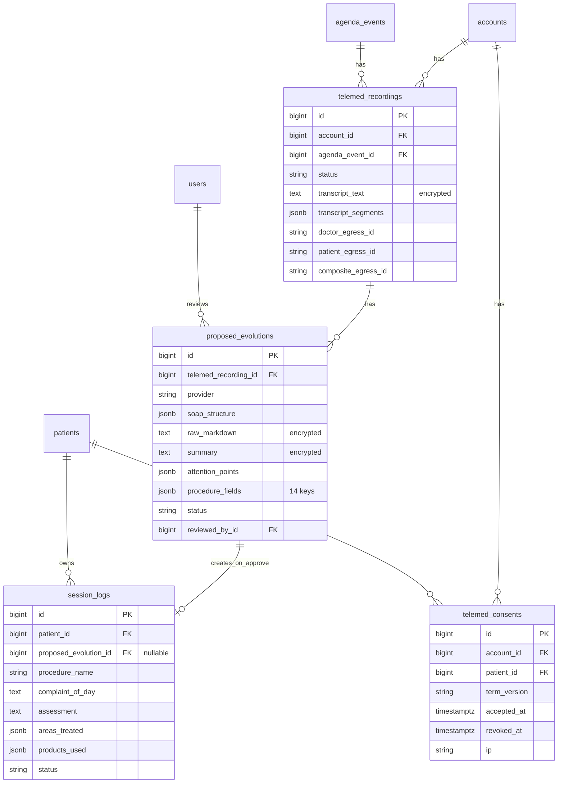

# 03 — Modelo de Dados

## 3.1 Visão geral

3 tabelas próprias + 2 FKs em tabelas existentes:

```
┌─────────────────────┐    ┌──────────────────────┐    ┌───────────────────┐
│ telemed_recordings  │◄──►│ proposed_evolutions  │───►│ session_logs      │
│ (1 por consulta)    │    │ (1 por recording)    │    │ (criada no approve)│
└─────────────────────┘    └──────────────────────┘    └───────────────────┘
       │                                                       ▲
       │ ref                                                   │ FK nova
       ▼                                                       │
┌─────────────────────┐                                        │
│ agenda_events       │                                        │
│ (core)              │                                        │
└─────────────────────┘                                        │
       │                                                       │
       │ contact_id                                             │
       ▼                                                       │
┌─────────────────────┐    ┌──────────────────────┐            │
│ contacts (core)     │    │ patients (core)      │────────────┘
└─────────────────────┘    └──────────────────────┘
       │
       │ por consent
       ▼
┌─────────────────────┐
│ telemed_consents    │
│ (1 por aceite LGPD) │
└─────────────────────┘
```

---

## 3.2 Migrations (ordem cronológica)

| Data | Migration | O que cria |
|------|-----------|-----------|
| 20260520000001 | `create_telemed_recordings` | Tabela `telemed_recordings` |
| 20260520000002 | `create_proposed_evolutions` | Tabela `proposed_evolutions` |
| 20260520000003 | `add_source_to_clinical_notes` | Coluna `source` em `clinical_notes` (legado, mantido) |
| 20260520000004 | `add_telemedicine_recording_to_patient_portal_settings` | Coluna `telemedicine_recording` (jsonb) em settings |
| 20260520000005 | `add_audio_only_telemed_columns` | Colunas `*_audio_key` em `telemed_recordings` |
| 20260521000001 | `create_telemed_consents` | Tabela `telemed_consents` |
| 20260521000002 | `migrate_telemedicine_recording_consents` | Data: move consents legados |
| 20260521000003 | `add_telemed_audit_phase2_indexes` | Indexes de performance |
| 20260521000004 | `add_proposed_evolution_uniqueness_guard` | Unique partial index `(recording_id) WHERE status='pending_review'` |
| 20260522000001 | `add_summary_to_proposed_evolutions` | Coluna `summary` (text encrypted) |
| 20260525000001 | `remove_gemini_review_configs` | Limpa configs do Gemini (descontinuado) |
| 20260526000001 | `add_procedure_fields_to_proposed_evolutions` | Coluna `procedure_fields` (jsonb 14 chaves) |
| 20260526000002 | `add_proposed_evolution_id_to_session_logs` | FK `session_logs.proposed_evolution_id` |

---

## 3.3 Schema completo

### 3.3.1 `telemed_recordings`

```sql
CREATE TABLE telemed_recordings (
  id                       BIGSERIAL PRIMARY KEY,
  account_id               BIGINT NOT NULL,
  agenda_event_id          BIGINT NOT NULL,
  status                   VARCHAR DEFAULT 'pending' NOT NULL,
  -- pending, recording, uploaded, transcribing, transcribed, evolving, ready, failed

  -- Egress IDs (LiveKit) por role
  doctor_egress_id         VARCHAR,
  patient_egress_id        VARCHAR,
  composite_egress_id      VARCHAR,

  -- Storage keys no R2 (3 arquivos .ogg)
  doctor_audio_key         VARCHAR,
  patient_audio_key        VARCHAR,
  composite_audio_key      VARCHAR,

  -- Transcrição (encrypted via ActiveRecord encryption)
  transcript_text          TEXT,
  transcript_segments      JSONB DEFAULT '[]' NOT NULL,
  -- Estrutura de segmento: { start: 12.5, end: 18.2, text: "...", speaker: "doctor" }

  -- Metadados
  duration_seconds         INTEGER,
  audio_size_bytes         BIGINT,
  retry_count              INTEGER DEFAULT 0 NOT NULL,
  failure_reason           TEXT,
  archived_at              TIMESTAMPTZ,
  custom_attributes        JSONB DEFAULT '{}' NOT NULL,
  -- Usado pra { 'telemed_session': { 'published_tracks': {...}, 'doctor_joined_at': ... } }

  created_at               TIMESTAMPTZ NOT NULL,
  updated_at               TIMESTAMPTZ NOT NULL
);

CREATE INDEX idx_telemed_recordings_on_account_id ON telemed_recordings(account_id);
CREATE INDEX idx_telemed_recordings_on_agenda_event_id ON telemed_recordings(agenda_event_id);
CREATE INDEX idx_telemed_recordings_on_status ON telemed_recordings(status);
CREATE INDEX idx_telemed_recordings_account_created ON telemed_recordings(account_id, created_at);
CREATE INDEX idx_telemed_recordings_doctor_egress ON telemed_recordings(doctor_egress_id);
CREATE INDEX idx_telemed_recordings_patient_egress ON telemed_recordings(patient_egress_id);
CREATE INDEX idx_telemed_recordings_composite_egress ON telemed_recordings(composite_egress_id);
```

**Transições válidas** (state machine no model):
```
pending → recording (webhook egress_started)
recording → uploaded (webhook egress_ended success)
uploaded → transcribing (TranscribeRecordingJob start)
transcribing → transcribed (TranscribeRecordingJob success)
transcribed → evolving (GenerateEvolutionJob start)
evolving → ready (GenerateEvolutionJob success)
qualquer → failed (erro permanente)
```

Validação `before_save` previne regressões (`pending` → `ready` direto).

**Encryption**: `encrypts :transcript_text` (LGPD — contém fala literal com nome/queixa do paciente).

---

### 3.3.2 `proposed_evolutions`

```sql
CREATE TABLE proposed_evolutions (
  id                    BIGSERIAL PRIMARY KEY,
  telemed_recording_id  BIGINT NOT NULL,
  clinical_note_id      BIGINT,   -- legado, NULL nas aprovações novas
  provider              VARCHAR NOT NULL,   -- 'claude/claude-sonnet-4-6'
  soap_structure        JSONB DEFAULT '{}' NOT NULL,
  -- Estrutura: { subjetivo: '...', objetivo: '...', avaliacao: '...', plano: '...' }
  raw_markdown          TEXT,
  summary               TEXT,  -- Markdown "Resumo Executivo"
  attention_points      JSONB DEFAULT '[]' NOT NULL,
  -- Estrutura: [{ type: 'alergy|medication|systemic|behavior|other', severity: 'low|medium|high', text: '...' }]
  procedure_fields      JSONB DEFAULT '{}' NOT NULL,
  -- 14 chaves (ver 3.4.1)
  status                VARCHAR DEFAULT 'pending_review' NOT NULL,
  -- pending_review, edited, approved, rejected
  reviewed_by_id        BIGINT,  -- User
  reviewed_at           TIMESTAMPTZ,
  reviewer_notes        TEXT,    -- justificativa rejeição
  input_tokens          INTEGER,
  output_tokens         INTEGER,
  created_at            TIMESTAMPTZ NOT NULL,
  updated_at            TIMESTAMPTZ NOT NULL
);

CREATE INDEX idx_proposed_evolutions_on_clinical_note_id ON proposed_evolutions(clinical_note_id);
CREATE INDEX idx_proposed_evolutions_on_reviewed_by_id ON proposed_evolutions(reviewed_by_id);
CREATE INDEX idx_proposed_evolutions_on_status ON proposed_evolutions(status);
CREATE INDEX idx_proposed_evolutions_status_updated ON proposed_evolutions(status, updated_at);
CREATE INDEX idx_proposed_evolutions_on_recording_and_created ON proposed_evolutions(telemed_recording_id, created_at);
CREATE INDEX idx_proposed_evolutions_on_telemed_recording_id ON proposed_evolutions(telemed_recording_id);

-- Crítico: bloqueia 2 propostas pending_review simultâneas no mesmo recording (race em retry)
CREATE UNIQUE INDEX idx_proposed_evolutions_unique_pending_per_recording
  ON proposed_evolutions(telemed_recording_id)
  WHERE status = 'pending_review';
```

**Encryption**: `encrypts :raw_markdown, :reviewer_notes, :summary`.

---

### 3.3.3 `telemed_consents`

```sql
CREATE TABLE telemed_consents (
  id              BIGSERIAL PRIMARY KEY,
  account_id      BIGINT NOT NULL,
  patient_id      BIGINT NOT NULL,
  term_version    VARCHAR NOT NULL,    -- ex: 'v1', 'v2-2026-05'
  accepted_at     TIMESTAMPTZ NOT NULL,
  ip              VARCHAR,
  user_agent      TEXT,
  revoked_at      TIMESTAMPTZ,         -- NULL = ativo
  revoke_reason   TEXT,
  created_at      TIMESTAMPTZ NOT NULL,
  updated_at      TIMESTAMPTZ NOT NULL
);

CREATE INDEX idx_telemed_consents_on_patient_id ON telemed_consents(patient_id);
CREATE INDEX idx_telemed_consents_on_account_id ON telemed_consents(account_id);
CREATE UNIQUE INDEX idx_telemed_consents_unique_per_term
  ON telemed_consents(account_id, patient_id, term_version);
```

**Idempotência**: método `TelemedConsent.accept!(account:, patient:, term_version:, ip:, user_agent:)` que:
- Se já existe ativo: retorna existente.
- Se existe revogado: revive (re-aceite explícito, LGPD Art. 8º §5º).
- Se não existe: cria.

---

### 3.3.4 Coluna `procedure_fields` (jsonb) — 14 chaves

Schema do conteúdo:

```json
{
  "queixa_do_dia":             "string",
  "avaliacao_clinica":         "string",
  "procedimento_realizado":    "string",
  "area_tratada":              "string",
  "produto_utilizado":         "string",
  "quantidade_dose":           "string",
  "unidade":                   "string",
  "lote":                      "string",
  "validade":                  "string (YYYY-MM-DD ou vazio)",
  "intercorrencias":           "string",
  "resultado_imediato":        "string",
  "detalhes_proxima_consulta": "string",
  "retorno_em_dias":           42,     // integer ou null
  "observacao":                "string"
}
```

Validação backend: whitelist explícita em `ProposedEvolutionsController` previne mass assignment via JSONB. Ver [04-backend.md](04-backend.md#proposedeevolutionscontroller).

Mapeamento `procedure_fields → SessionLog` no approve: ver [04-backend.md](04-backend.md#proposedeevolutionapprovalservice).

---

### 3.3.5 `session_logs.proposed_evolution_id` (FK nova)

```sql
ALTER TABLE session_logs
  ADD COLUMN proposed_evolution_id BIGINT;

CREATE INDEX idx_session_logs_on_proposed_evolution_id
  ON session_logs(proposed_evolution_id);

ALTER TABLE session_logs
  ADD FOREIGN KEY (proposed_evolution_id)
  REFERENCES proposed_evolutions(id) ON DELETE SET NULL;
```

Permite trilha bidirecional: dado um `SessionLog`, saber se veio de teleconsulta (e qual). Bloquear edição de campos vindos da IA ou marcar visualmente.

---

### 3.3.6 `patient_portal_settings.telemedicine_recording` (jsonb)

Coluna adicionada via migration `20260520000004`. Conteúdo:

```json
{
  "enabled": true,
  "ai_provider": "claude-sonnet-4.6",
  "ai_evolution_enabled": true,
  "max_active_recordings": 15,
  "patient_consent_required": false
}
```

`max_active_recordings`: usado por `EnforceRecordingQuotaJob` pra arquivar gravações antigas além desse limite (custo storage).

---

## 3.4 Encryption (ActiveRecord 7.1)

### Models afetados

| Model | Columns encriptadas |
|-------|---------------------|
| `TelemedRecording` | `transcript_text` |
| `ProposedEvolution` | `raw_markdown`, `reviewer_notes`, `summary` |

### Configuração

`config/application.rb` (core Klivy):

```ruby
config.active_record.encryption.support_unencrypted_data = true
# permite ler plaintext antigo (migração suave); novos saves são encrypted
```

ENV obrigatório em prod:

```bash
ACTIVE_RECORD_ENCRYPTION_PRIMARY_KEY=...
ACTIVE_RECORD_ENCRYPTION_DETERMINISTIC_KEY=...
ACTIVE_RECORD_ENCRYPTION_KEY_DERIVATION_SALT=...
```

Boot guard em `config/initializers/telemed.rb` aborta o boot em prod se faltar.

### Implicação operacional

Backup/restore: a primary key precisa estar acessível no ambiente de restore — sem ela, transcripts ficam ilegíveis. Recomendação: armazenar keys em secret manager (AWS Secrets Manager / GCP Secret Manager / 1Password Connect) com replicação multi-região.

---

## 3.5 Diagrama relacional (Mermaid)



---

## 3.6 Volume estimado (capacity planning)

Estimativa pra clínica com **100 consultas/mês**, consultas de 30 min:

| Recurso | Tamanho por consulta | 100/mês | 1 ano |
|---------|----------------------|---------|-------|
| `telemed_recordings` row | ~5 KB (sem transcript) | 500 KB | 6 MB |
| `transcript_text` encrypted | ~15 KB | 1.5 MB | 18 MB |
| `transcript_segments` jsonb | ~50 KB | 5 MB | 60 MB |
| `proposed_evolutions` row | ~10 KB | 1 MB | 12 MB |
| R2 audio (`composite` apenas, após pruning) | ~28 MB | 2.8 GB | 33 GB |

A maior parte do storage vai ser **R2** (áudio). PostgreSQL fica enxuto. Recomenda-se lifecycle rule no R2 deletando após 30-90 dias (auditoria + CFM exige só os 20 anos de **prontuário**, não da gravação).
